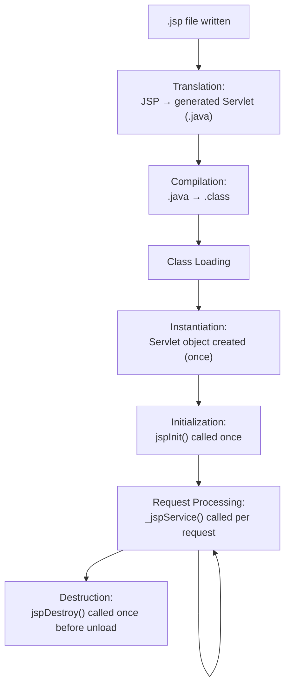
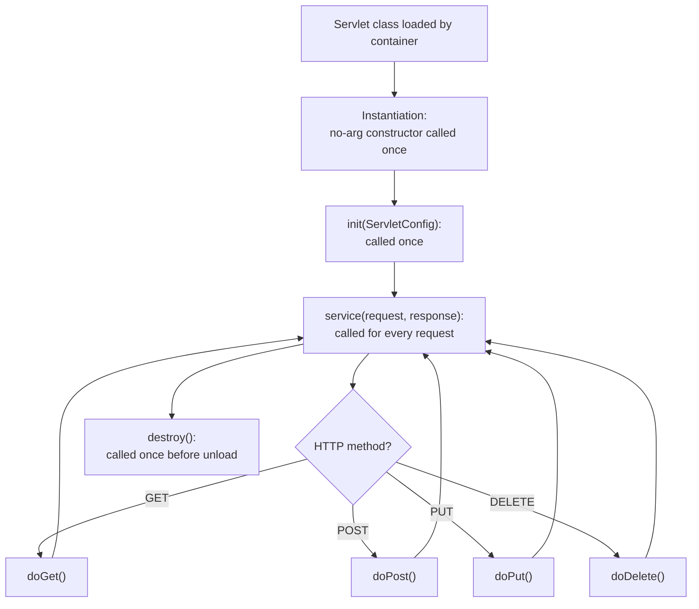
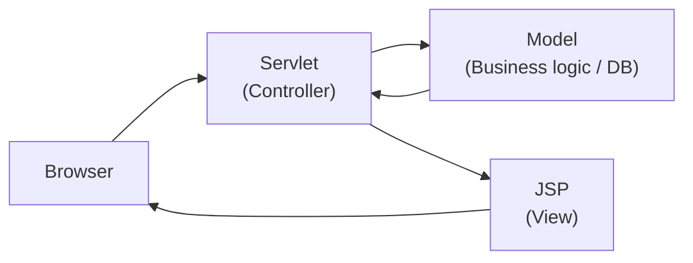

# JSP & Servlets — Revision & Interview Notes

> Structured reference notes covering JSP fundamentals, elements, directives, tags, and the Servlet/JSP life cycles — with runnable examples and diagrams.

---

## Table of Contents

1. [What is JSP?](#1-what-is-jsp)
2. [JSP vs Servlet](#2-jsp-vs-servlet)
3. [JSP Elements](#3-jsp-elements)
   - [3.1 Scripting Elements (Declaration, Scriptlet, Expression)](#31-scripting-elements)
   - [3.2 Directive Elements](#32-directive-elements)
   - [3.3 Action Elements (JSP Tags)](#33-action-elements-jsp-tags)
   - [3.4 Comments](#34-comments)
4. [JSP Life Cycle](#4-jsp-life-cycle)
5. [Servlet Life Cycle](#5-servlet-life-cycle)
6. [JSP Implicit Objects](#6-jsp-implicit-objects)
7. [Bonus: MVC Model 1 vs Model 2](#7-bonus-mvc-model-1-vs-model-2)
8. [Quick Cheat Sheet](#8-quick-cheat-sheet)
9. [Common Interview Q&A](#9-common-interview-qa)

---

## 1. What is JSP?

**JSP (JavaServer Pages)** is a server-side technology that lets you embed Java code inside HTML using special tags. It is built **on top of Servlets** — every JSP page is internally converted into a Servlet by the JSP engine (e.g., Jasper in Tomcat) before it runs.

```
Browser Request → JSP Page → (translated to) → Servlet → (compiled to) → .class → Response
```

**Why JSP exists:** Writing HTML inside a Servlet using `out.println()` for every line is painful to maintain. JSP flips that — you write HTML normally, and only the dynamic parts use Java.

```java
// Servlet approach — ugly to maintain
out.println("<html><body>");
out.println("<h1>Welcome " + name + "</h1>");
out.println("</body></html>");
```

```jsp
<!-- JSP approach — clean -->
<html><body>
  <h1>Welcome <%= name %></h1>
</body></html>
```

---

## 2. JSP vs Servlet

| Aspect | Servlet | JSP |
|---|---|---|
| **Nature** | Pure Java class implementing `Servlet` interface | HTML page with embedded Java; compiled into a Servlet internally |
| **Primary use** | Business logic, request handling, controllers | Presentation layer / view rendering |
| **Code style** | Java code with HTML written via `out.println()` | HTML code with Java embedded via tags |
| **Compilation** | Compiled manually / by build tool ahead of deployment | Auto-compiled by the container on first request (or pre-compiled) |
| **Modification** | Requires recompilation + redeployment | Container auto-detects changes and recompiles |
| **MVC role** | Acts as **Controller** | Acts as **View** |
| **Implicit objects** | None — must create `request`, `response` etc. manually | 9 implicit objects available out of the box (`request`, `session`, `out`, etc.) |
| **Ease of HTML** | Hard to write/maintain large HTML | Easy — it *is* HTML with Java sprinkled in |
| **Tag support** | No tag library support | Supports custom tags, JSTL, EL |
| **First request latency** | None (already compiled) | Slightly slower on first hit (translation + compilation happens) |

**Interview one-liner:** *"A JSP is just a Servlet with a friendlier face — under the hood, the container translates every JSP into a Servlet. Servlets are better for logic/control flow; JSPs are better for rendering views."*

---

## 3. JSP Elements

JSP elements fall into three categories: **Scripting**, **Directive**, and **Action** elements.

### 3.1 Scripting Elements

These let you embed Java logic directly into the page. There are three types: **Declaration**, **Scriptlet**, and **Expression**.

#### a) Declaration `<%! ... %>`

Declares **variables or methods at the class level** of the generated servlet (i.e., outside the `_jspService()` method). These become instance members — shared across all requests, so be careful with thread safety.

```jsp
<%! 
   private int visitCount = 0;

   public int incrementAndGetCount() {
       return ++visitCount;
   }
%>

<p>You are visitor number: <%= incrementAndGetCount() %></p>
```

> ⚠️ **Interview trap:** Variables declared with `<%! %>` are **instance variables of the servlet** — shared across *all users* hitting that JSP, because the servlet instance is reused. This can cause data leaking between users if misused. Use scriptlet-local variables instead for per-request data.

#### b) Scriptlet `<% ... %>`

Contains **plain Java code** that gets inserted as-is into the `_jspService()` method (runs on every request). Can contain statements, loops, conditionals.

```jsp
<%
   int x = 10;
   int y = 20;
   int sum = x + y;
%>

<% if (sum > 25) { %>
    <p>Sum is greater than 25</p>
<% } else { %>
    <p>Sum is 25 or less</p>
<% } %>
```

Loop example:

```jsp
<ul>
<% for (int i = 1; i <= 5; i++) { %>
    <li>Item <%= i %></li>
<% } %>
</ul>
```

#### c) Expression `<%= ... %>`

Evaluates a **Java expression**, converts the result to a `String`, and inserts it directly into the output. **No semicolon** at the end.

```jsp
<p>Current time: <%= new java.util.Date() %></p>
<p>2 + 3 = <%= 2 + 3 %></p>
<p>Username: <%= request.getParameter("username") %></p>
```

| Type | Syntax | Scope of code | Use case |
|---|---|---|---|
| Declaration | `<%! %>` | Class level (instance members/methods) | Helper methods, shared counters |
| Scriptlet | `<% %>` | Method level (per-request) | Logic, loops, conditionals |
| Expression | `<%= %>` | Inline, returns a value | Printing a value directly |

### 3.2 Directive Elements

Directives give **instructions to the JSP container** about the page itself — they don't produce output directly. Syntax: `<%@ directive attribute="value" %>`

#### a) `page` directive

Defines page-level settings such as imports, content type, session usage, and error handling.

```jsp
<%@ page import="java.util.*, java.text.SimpleDateFormat" %>
<%@ page contentType="text/html;charset=UTF-8" %>
<%@ page session="true" %>
<%@ page errorPage="error.jsp" %>
<%@ page isErrorPage="false" %>
```

Common attributes:

| Attribute | Purpose |
|---|---|
| `import` | Import Java packages |
| `contentType` | MIME type & charset of response |
| `session` | Whether page participates in HTTP session (default `true`) |
| `errorPage` | Page to forward to if an exception occurs |
| `isErrorPage` | Marks this page as an error-handling page (enables `exception` object) |
| `isELIgnored` | Whether to ignore Expression Language `${}` |
| `buffer` | Output buffer size (e.g., `8kb`) |
| `autoFlush` | Auto-flush buffer when full |

#### b) `include` directive

Includes content from another file **at translation time** (static include) — the included file's content is merged into the JSP *before* compilation, like a copy-paste.

```jsp
<%@ include file="header.jsp" %>
<h1>Main page content</h1>
<%@ include file="footer.jsp" %>
```

> Static include (`<%@ include %>`) vs. dynamic include (`<jsp:include>`) — see Action Elements below.

#### c) `taglib` directive

Declares a tag library (e.g., JSTL) so its custom tags can be used in the page.

```jsp
<%@ taglib uri="http://java.sun.com/jsp/jstl/core" prefix="c" %>

<c:if test="${user != null}">
    <p>Welcome, ${user.name}</p>
</c:if>
```

### 3.3 Action Elements (JSP Tags)

Action elements are **XML-style tags** that perform actions like including files dynamically, forwarding requests, or working with JavaBeans. These execute at **request time**, unlike directives.

| Tag | Purpose |
|---|---|
| `<jsp:include>` | Dynamically include another resource's output at **request time** |
| `<jsp:forward>` | Forward the request to another resource (servlet/JSP) |
| `<jsp:useBean>` | Locate or instantiate a JavaBean |
| `<jsp:setProperty>` | Set a property on a bean |
| `<jsp:getProperty>` | Print a bean property's value |
| `<jsp:param>` | Pass a parameter (used with include/forward) |

```jsp
<!-- Dynamic include: runs the target at request time -->
<jsp:include page="menu.jsp">
    <jsp:param name="activeTab" value="home" />
</jsp:include>

<!-- Forward control to another page -->
<jsp:forward page="dashboard.jsp" />

<!-- JavaBean usage -->
<jsp:useBean id="user" class="com.app.model.User" scope="session" />
<jsp:setProperty name="user" property="name" value="Alice" />
<p>Hello, <jsp:getProperty name="user" property="name" /></p>
```

**`<%@ include %>` vs `<jsp:include>`:**

| | `<%@ include %>` (directive) | `<jsp:include>` (action) |
|---|---|---|
| When merged | Translation time (static) | Request time (dynamic) |
| Performance | Faster (no extra request) | Slightly slower (separate request to included resource) |
| Flexibility | Included content is fixed | Can pass parameters, target can be decided at runtime |
| Use case | Static headers/footers | Reusable components needing fresh data per request |

### 3.4 Comments

```jsp
<%-- This is a JSP comment — NOT sent to the client, removed at translation --%>
<!-- This is an HTML comment — IS sent to the client's browser -->
```

---

## 4. JSP Life Cycle

A `.jsp` file goes through several phases before it can serve a request:



| Phase | Description |
|---|---|
| **Translation** | The container converts the `.jsp` into a Java servlet source file (e.g., `index_jsp.java`). All scriptlets, expressions, and HTML are converted into Java statements. |
| **Compilation** | The generated `.java` file is compiled into a `.class` file. |
| **Instantiation** | The servlet class is loaded and an instance created — happens **once**. |
| **Initialization — `jspInit()`** | Called **once**, right after instantiation. Used to set up resources (DB connections, etc.). You can override this in a declaration block. |
| **Request processing — `_jspService()`** | Called **for every request**. This is where your scriptlets/expressions actually execute. You **cannot override** this method — it's auto-generated. |
| **Destruction — `jspDestroy()`** | Called **once**, just before the container removes the servlet instance (e.g., on shutdown/redeploy). Used to clean up resources. |

```jsp
<%! 
   public void jspInit() {
       System.out.println("JSP initialized — open resources here");
   }

   public void jspDestroy() {
       System.out.println("JSP destroyed — close resources here");
   }
%>
```

> **Key interview point:** `_jspService()` is the JSP equivalent of a Servlet's `service()` method, but it's **auto-generated by the container** — you write scriptlets/expressions, and they all get woven into this method.

---

## 5. Servlet Life Cycle



| Method | Called | Purpose |
|---|---|---|
| **Constructor** | Once, when container loads the servlet | Basic object creation |
| **`init(ServletConfig config)`** | Once, immediately after instantiation | One-time setup: read init-params, open resources |
| **`service(HttpServletRequest, HttpServletResponse)`** | On every request | Dispatches to `doGet`/`doPost`/etc. based on HTTP method |
| **`doGet()` / `doPost()` / etc.** | On every matching request | Your actual request-handling logic |
| **`destroy()`** | Once, before the servlet is removed from service | Cleanup: close DB connections, release resources |

```java
public class UserServlet extends HttpServlet {

    @Override
    public void init(ServletConfig config) throws ServletException {
        System.out.println("Servlet initialized");
        // e.g., open a connection pool
    }

    @Override
    protected void doGet(HttpServletRequest req, HttpServletResponse resp)
            throws ServletException, IOException {
        resp.setContentType("text/html");
        PrintWriter out = resp.getWriter();
        out.println("<h1>Hello from Servlet!</h1>");
    }

    @Override
    protected void doPost(HttpServletRequest req, HttpServletResponse resp)
            throws ServletException, IOException {
        String name = req.getParameter("name");
        resp.getWriter().println("Received: " + name);
    }

    @Override
    public void destroy() {
        System.out.println("Servlet destroyed");
        // e.g., close connection pool
    }
}
```

**Servlet life cycle vs JSP life cycle — side by side:**

| Servlet | JSP equivalent |
|---|---|
| (you write the whole class) | Translation + Compilation (auto-generated servlet) |
| Constructor | Instantiation (auto) |
| `init()` | `jspInit()` |
| `service()` → `doGet()`/`doPost()` | `_jspService()` (auto-generated, holds your scriptlets) |
| `destroy()` | `jspDestroy()` |

---

## 6. JSP Implicit Objects

JSP automatically provides 9 objects inside `_jspService()` — you don't need to create them:

| Object | Type | Purpose |
|---|---|---|
| `request` | `HttpServletRequest` | Access request parameters, headers |
| `response` | `HttpServletResponse` | Control the response |
| `out` | `JspWriter` | Write output to the client |
| `session` | `HttpSession` | Store per-user session data |
| `application` | `ServletContext` | App-wide shared data |
| `config` | `ServletConfig` | Servlet's init configuration |
| `pageContext` | `PageContext` | Access to all other scopes, useful for forwarding |
| `page` | `Object` (this) | Reference to the current JSP's servlet instance |
| `exception` | `Throwable` | Only available on pages with `isErrorPage="true"` |

```jsp
<%-- Using a few implicit objects --%>
<p>Your session ID: <%= session.getId() %></p>
<p>Server info: <%= application.getServerInfo() %></p>
<% request.setAttribute("status", "active"); %>
```

---

## 7. Bonus: MVC Model 1 vs Model 2

Since JSP/Servlet questions often pair with **architecture**, here's a quick note:

| | Model 1 | Model 2 (MVC) |
|---|---|---|
| Controller | JSP itself handles logic + view | A dedicated **Servlet** acts as controller |
| View | JSP (mixed with logic) | JSP (pure presentation, uses beans/EL) |
| Maintainability | Poor for large apps — logic & view mixed | Better — clear separation of concerns |
| Typical flow | Browser → JSP (does everything) | Browser → Servlet (controller) → Model (business logic) → JSP (view) |



---

## 8. Quick Cheat Sheet

```jsp
<%-- COMMENT --%>                     JSP comment (not sent to browser)

<%! int x; %>                         DECLARATION  → class-level field/method
<% x = 5; %>                          SCRIPTLET    → Java code, per-request
<%= x %>                              EXPRESSION   → prints value, no semicolon

<%@ page import="java.util.*" %>      PAGE directive
<%@ include file="header.jsp" %>      INCLUDE directive (static, translation time)
<%@ taglib uri="..." prefix="c" %>    TAGLIB directive

<jsp:include page="a.jsp" />          Dynamic include (request time)
<jsp:forward page="b.jsp" />          Forward request
<jsp:useBean id="u" class="..." />    Bean instantiation
```

**Life cycle methods quick recall:**

- Servlet: `init()` → `service()` → `doGet()/doPost()` → `destroy()`
- JSP: `jspInit()` → `_jspService()` (auto) → `jspDestroy()`

---

## 9. Common Interview Q&A

**Q1: Why is JSP preferred over Servlet for the view layer?**
A: JSP lets you write HTML naturally with Java embedded only where needed, whereas a Servlet would require `out.println()` for every line of HTML — hard to read and maintain.

**Q2: What happens internally when a JSP is requested for the first time?**
A: The container translates the JSP into a servlet `.java` file, compiles it to `.class`, loads it, instantiates it, and calls `jspInit()` before serving the request via `_jspService()`. Subsequent requests skip translation/compilation (unless the JSP file changes).

**Q3: Can you override `_jspService()`?**
A: No — it's auto-generated by the container from your scriptlets/expressions/template text. You *can* override `jspInit()` and `jspDestroy()` via declarations.

**Q4: Difference between scriptlet and expression?**
A: A scriptlet (`<% %>`) contains arbitrary Java statements (needs semicolons, can have loops/conditionals) but produces no automatic output. An expression (`<%= %>`) evaluates to a single value that's automatically converted to a `String` and written to the response — no semicolon allowed.

**Q5: Why are declaration-block variables risky?**
A: They become instance variables of the generated servlet, which the container typically reuses across multiple concurrent requests — leading to shared mutable state and potential thread-safety/data-leak issues between users.

**Q6: Difference between `<%@ include %>` and `<jsp:include>`?**
A: The directive (`<%@ include %>`) merges content at **translation time** (static, faster, fixed content). The action tag (`<jsp:include>`) includes content dynamically at **request time**, can pass parameters, and can decide the target page at runtime.

**Q7: What triggers `destroy()`/`jspDestroy()`?**
A: Container shutdown, application redeployment, or the container deciding to remove the servlet instance from service — always called exactly once before the instance is garbage collected.

**Q8: Is a Servlet or JSP instance created per request?**
A: No — by default, **one instance** of a Servlet/JSP-generated-servlet handles **all requests concurrently** (multi-threaded). This is why thread safety of shared/instance fields matters.
