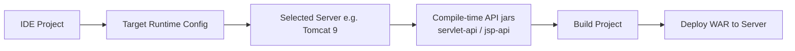
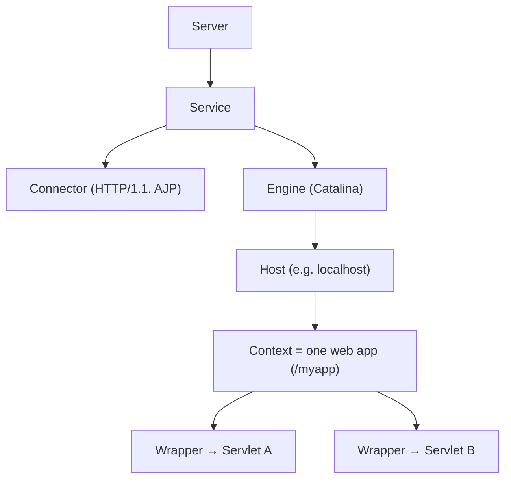
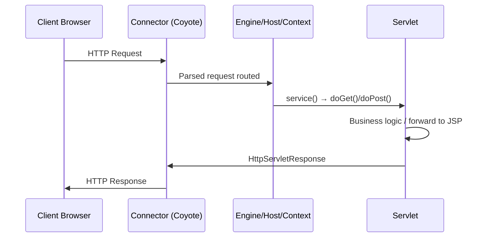
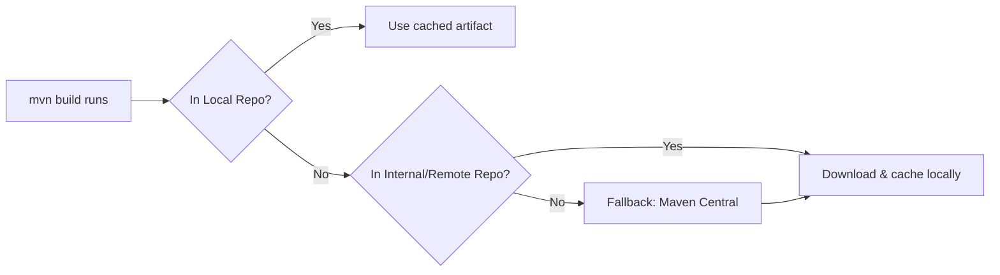
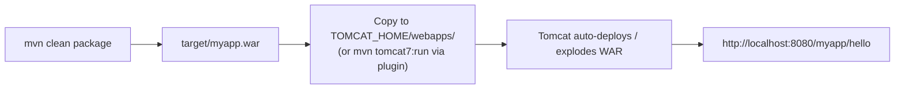
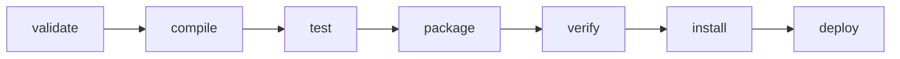
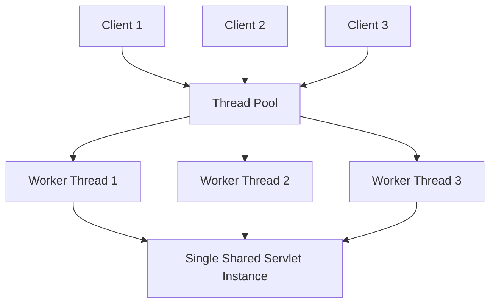
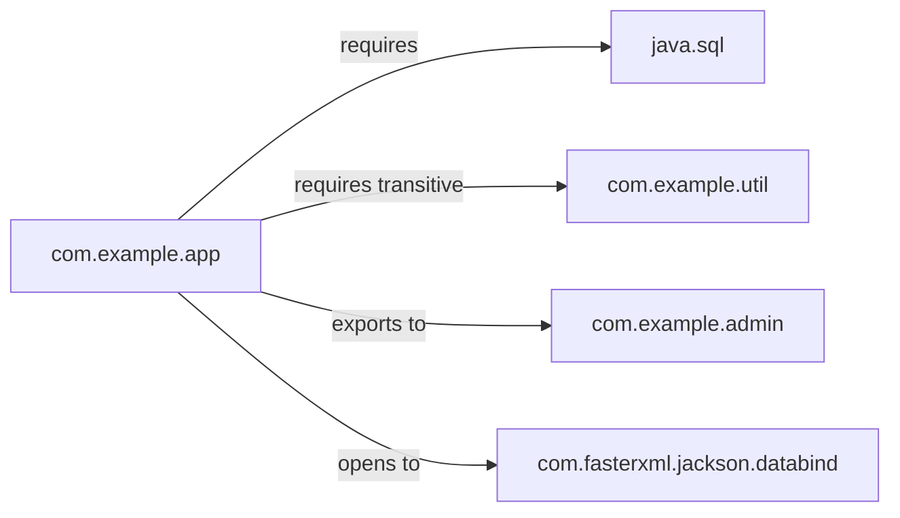

# Java Web Application Stack — Interview Notes

*Target Runtime · Apache Tomcat · Maven Repositories · Servlet/JSP Setup · Maven Commands · Threading Model · Java Modules (JPMS)*

---

## Table of Contents

1. [Target Runtime Server in Java](#1-target-runtime-server-in-java)
2. [Apache Tomcat — Architecture & Internals](#2-apache-tomcat--architecture--internals)
3. [Maven Repositories + Servlet/JSP App Setup](#3-maven-repositories--servletjsp-app-setup)
4. [Maven Commands & Project Structure](#4-maven-commands--project-structure)
5. [Threading Model in Servlet-based Applications](#5-threading-model-in-servlet-based-applications)
6. [Java Module System (JPMS) — module-info.java Directives](#6-java-module-system-jpms--module-infojava-directives)
7. [Quick Interview Q&A Cheat Sheet](#7-quick-interview-qa-cheat-sheet)

---

## 1. Target Runtime Server in Java

### Theory
When you create a **Dynamic Web Project** in an IDE (Eclipse, IntelliJ, NetBeans), the **Target Runtime** tells the IDE which server environment the project is built for. The IDE uses this to:

- Add server-provided libraries (`servlet-api.jar`, `jsp-api.jar`) to the **build path** without packaging them inside the WAR — this mirrors Maven's `provided` scope.
- Know how to **start / stop / debug** a local server instance and auto-deploy the project to it.
- Validate **spec-version compatibility** (e.g., Tomcat 9 → Servlet 4.0 / JSP 2.3, Tomcat 10 → Servlet 5.0 with the `jakarta.*` namespace).

If the target runtime isn't set, the IDE doesn't know which Servlet API version to compile against → errors like `HttpServlet cannot be resolved`.

### Setup (Eclipse example)
1. Right-click project → **Properties** → **Targeted Runtimes** → check the desired Tomcat version.
2. Or at project creation: File → New → Dynamic Web Project → Target Runtime → **New...** → point to your local Tomcat install folder.

### Diagram



### Interview points
- Target Runtime is a **build-time/IDE concept**, not the actual deployment target — you can compile against Tomcat 9 APIs and still deploy the WAR anywhere compatible.
- A mismatch between the configured runtime version and the real server version is a classic cause of `NoSuchMethodError` / `ClassNotFoundException` at deploy time.
- In `jakarta.*` (Tomcat 10+) vs `javax.*` (Tomcat 9 and earlier) — a very common "gotcha" in interviews and real migrations.

---

## 2. Apache Tomcat — Architecture & Internals

### Theory
Apache Tomcat is an open-source **Servlet Container** (a.k.a. web container) implementing:

- Java/Jakarta **Servlet** specification
- **JavaServer Pages (JSP)**
- **Expression Language (EL)**
- **Java WebSocket**

It is **not** a full Java EE / Jakarta EE application server (no built-in EJB, JMS, JTA) — that role belongs to WildFly, GlassFish, Payara, etc. Tomcat is lightweight and is also the embedded server inside Spring Boot by default.

### Core internal components
| Component | Role |
|---|---|
| **Catalina** | The servlet container engine itself — manages the lifecycle of servlets |
| **Coyote** | The HTTP connector — parses raw HTTP requests/responses |
| **Jasper** | JSP engine — compiles `.jsp` → `.java` servlet → `.class` at runtime/first request |
| **Cluster / Session Manager** | Handles session replication across nodes |

### Directory structure
```
TOMCAT_HOME/
 ├─ bin/      → startup.sh, shutdown.sh, catalina.sh
 ├─ conf/     → server.xml, web.xml, context.xml, tomcat-users.xml
 ├─ lib/      → shared JARs (servlet-api, jsp-api, etc.)
 ├─ logs/     → catalina.out, access logs
 ├─ webapps/  → deployed applications (WAR or exploded folder)
 ├─ work/     → compiled JSP → servlet .class files (Jasper output)
 └─ temp/     → scratch/temp space
```

### Component hierarchy (defined in `server.xml`)



### Request lifecycle



### Interview points
- Tomcat ≠ full Java EE server — clarify scope if asked "is Tomcat a Java EE server?"
- `web.xml` (deployment descriptor) vs annotation-based config (`@WebServlet`) — Servlet 3.0+ supports both; annotations reduce boilerplate.
- Connector types: **HTTP connector** (direct) vs **AJP connector** (used behind Apache HTTPD via `mod_jk`/`mod_proxy_ajp`, or behind a reverse proxy).
- `Context` reload (`context.xml` `reloadable="true"`) re-deploys app without restarting Tomcat — useful in dev, avoided in prod (perf cost).

---

## 3. Maven Repositories + Servlet/JSP App Setup

### Maven repository types
| Type | Location | Purpose |
|---|---|---|
| **Local repo** | `~/.m2/repository` | Cache on your machine |
| **Central repo** | repo.maven.apache.org | Public default repository |
| **Remote/internal repo** | Nexus / Artifactory / JFrog | Company-hosted, private/internal artifacts |

**Resolution order:** local repo → repositories declared in `pom.xml`/`settings.xml` → Maven Central (fallback). Once resolved, the artifact is cached in the local repo.



### Setting up a Servlet + JSP app with Maven

**`pom.xml` essentials**
```xml
<packaging>war</packaging>

<dependencies>
  <dependency>
    <groupId>javax.servlet</groupId>
    <artifactId>javax.servlet-api</artifactId>
    <version>4.0.1</version>
    <scope>provided</scope>          <!-- container supplies it at runtime -->
  </dependency>
  <dependency>
    <groupId>javax.servlet.jsp.jstl</groupId>
    <artifactId>jstl</artifactId>
    <version>1.2</version>
  </dependency>
</dependencies>

<build>
  <finalName>myapp</finalName>
  <plugins>
    <plugin>
      <groupId>org.apache.maven.plugins</groupId>
      <artifactId>maven-war-plugin</artifactId>
      <version>3.4.0</version>
    </plugin>
  </plugins>
</build>
```
> `provided` scope = available at **compile time**, but Tomcat supplies the actual implementation at **runtime** — so it must be excluded from the WAR to avoid classpath conflicts.

**Standard Maven webapp layout**
```
myapp/
 ├─ pom.xml
 └─ src/
     └─ main/
         ├─ java/                → Servlet/Java classes
         ├─ resources/           → config files, properties
         └─ webapp/
             ├─ WEB-INF/
             │   └─ web.xml
             ├─ index.jsp
             └─ css/, js/
```

**Servlet (annotation-based, Servlet 3.0+)**
```java
@WebServlet("/hello")
public class HelloServlet extends HttpServlet {
    @Override
    protected void doGet(HttpServletRequest req, HttpServletResponse resp)
            throws ServletException, IOException {
        req.setAttribute("message", "Hello from Servlet!");
        req.getRequestDispatcher("/result.jsp").forward(req, resp);
    }
}
```

**Equivalent classic `web.xml` mapping**
```xml
<servlet>
  <servlet-name>HelloServlet</servlet-name>
  <servlet-class>com.example.HelloServlet</servlet-class>
</servlet>
<servlet-mapping>
  <servlet-name>HelloServlet</servlet-name>
  <url-pattern>/hello</url-pattern>
</servlet-mapping>
```

**JSP view (`result.jsp`)**
```jsp
<%@ page contentType="text/html;charset=UTF-8" %>
<html>
<body>
  <h2>${message}</h2>
</body>
</html>
```

### Build & deploy flow



### Interview points
- Why `provided` scope for `servlet-api`? Prevents duplicate/conflicting Servlet API classes between your WAR and the container's own copy.
- **Servlet vs JSP**: Servlet = Java-driven controller logic; JSP = HTML-centric view, internally **compiled into a servlet** by Jasper at runtime.
- Classic **MVC mapping**: Servlet = Controller, JSP = View, JavaBean/DAO = Model.
- `forward()` (server-side, same request, URL unchanged) vs `sendRedirect()` (new request, URL changes, browser round-trip) — a frequent interview question.

---

## 4. Maven Commands & Project Structure

### Creating a new project (archetype)
```bash
mvn archetype:generate \
  -DgroupId=com.example \
  -DartifactId=myapp \
  -DarchetypeArtifactId=maven-archetype-webapp \
  -DinteractiveMode=false
```

### Maven build lifecycle (default phases, run in order)



Running any phase **automatically runs every phase before it** — e.g. `mvn install` triggers `compile`, `test`, `package` first.

### Common commands
| Command | Purpose |
|---|---|
| `mvn clean` | Delete the `target/` directory |
| `mvn compile` | Compile main sources |
| `mvn test` | Run unit tests |
| `mvn package` | Build the JAR/WAR into `target/` |
| `mvn install` | Install the artifact into the **local** repo (`~/.m2`) |
| `mvn deploy` | Publish artifact to a **remote/internal** repo |
| `mvn clean install -DskipTests` | Full rebuild, skipping tests |
| `mvn dependency:tree` | Visualize the dependency graph (spot conflicts) |
| `mvn versions:display-dependency-updates` | Check for newer dependency versions |
| `mvn tomcat7:run` | Run the WAR on an embedded Tomcat (requires plugin) |

### Interview points
- `mvn install` (local repo, for other local projects to consume) vs `mvn deploy` (remote/shared repo, for team/CI consumption) — commonly confused.
- **Dependency scopes**: `compile` (default, everywhere) · `provided` (compile + test, not packaged) · `runtime` (not needed to compile) · `test` (test only) · `system` (local file path, rarely used).
- **Transitive dependencies** & "dependency hell" — Maven resolves conflicts via the *nearest definition wins* rule; can be controlled with `<exclusions>` or `<dependencyManagement>`.
- `pom.xml` inheritance: parent POM → child POM, useful for multi-module projects.

---

## 5. Threading Model in Servlet-based Applications

### Theory
A servlet container creates **one instance** of each servlet class by default, but services concurrent HTTP requests using a **thread pool** — every incoming request is handled by a separate worker thread, and all of them invoke `service()` on the *same shared servlet instance*.

**Implication:** instance variables on a servlet are shared mutable state across threads → race conditions if not handled correctly. This is one of the most commonly tested "gotchas" in Java web interviews.

### Servlet life cycle
1. **`init()`** — called once, when the servlet is first loaded (container guarantees thread safety here).
2. **`service()` → `doGet()`/`doPost()`/etc.** — called **once per request**, on a thread pulled from Tomcat's worker thread pool — these run **concurrently**.
3. **`destroy()`** — called once, before the servlet is unloaded (e.g., on app shutdown).

### Diagram



### Safe vs unsafe code
```java
// ❌ UNSAFE — instance variable shared across all request threads
public class CounterServlet extends HttpServlet {
    private int count = 0;
    protected void doGet(HttpServletRequest req, HttpServletResponse resp) {
        count++;                 // race condition under concurrent load
    }
}

// ✅ SAFE — atomic / thread-safe state
public class CounterServlet extends HttpServlet {
    private final AtomicInteger count = new AtomicInteger(0);
    protected void doGet(HttpServletRequest req, HttpServletResponse resp) {
        count.incrementAndGet();
    }
}
```

> Best practice: keep per-request data in **local variables** or `HttpServletRequest`/`HttpSession` attributes, never in servlet instance fields, unless it's truly shared, immutable, or properly synchronized.

### Async servlets (Servlet 3.0+)
For long-running work (DB calls, external API calls), blocking a worker thread wastes pool capacity. Async support releases the container thread while the work continues elsewhere:

```java
@WebServlet(urlPatterns = "/report", asyncSupported = true)
public class ReportServlet extends HttpServlet {
    protected void doGet(HttpServletRequest req, HttpServletResponse resp) {
        AsyncContext ctx = req.startAsync();
        executorService.submit(() -> {
            // long-running work on a separate thread
            ctx.complete();
        });
    }
}
```

### Interview points
- `SingleThreadModel` (deprecated since Servlet 2.4) — created one servlet instance per thread; resource-heavy, never use it.
- Container thread pool size is configured via the `Connector` element's `maxThreads` attribute in `server.xml`.
- `HttpSession` is itself shared across multiple requests from the *same user* across different threads/tabs — another common concurrency trap.
- Difference between **container-managed concurrency** (servlet threads) and **application-managed concurrency** (your own `ExecutorService`, thread pools, etc.) is worth being able to articulate clearly.

---

## 6. Java Module System (JPMS) — module-info.java Directives

### Theory
Introduced in **Java 9** (Project Jigsaw) to add a layer above packages/JARs: explicit **modules** with declared dependencies and controlled visibility — solving "JAR hell" and the weak encapsulation problem where `public` meant *public to literally everyone on the classpath*.

A module is declared in a `module-info.java` file at the root of its source tree.

### Directives
| Directive | Meaning |
|---|---|
| `module com.example.app { }` | Declares a module |
| `requires com.example.util;` | Depends on another module, compile-time + runtime |
| `requires transitive com.example.util;` | Dependency is also visible to anyone who `requires` *this* module |
| `requires static com.example.util;` | Optional, compile-time-only dependency |
| `exports com.example.api;` | Makes a package's public types accessible to other modules |
| `exports com.example.api to com.example.client;` | **Qualified export** — visible only to the named module(s) |
| `opens com.example.model;` | Allows deep reflection at runtime (e.g. for Hibernate/Jackson) without a compile-time export |
| `opens com.example.model to com.fasterxml.jackson;` | Qualified `opens` |
| `uses com.example.spi.Plugin;` | Declares this module consumes a service via `ServiceLoader` |
| `provides com.example.spi.Plugin with com.example.impl.MyPlugin;` | Declares this module supplies a service implementation |

### Example
```java
module com.example.app {
    requires java.sql;
    requires transitive com.example.util;

    exports com.example.app.api;
    exports com.example.app.internal to com.example.admin;

    opens com.example.app.model to com.fasterxml.jackson.databind;

    uses com.example.app.spi.PaymentProvider;
    provides com.example.app.spi.PaymentProvider
        with com.example.app.impl.StripeProvider;
}
```

### Module dependency diagram



### Relevance to web applications (important nuance)
Most servlet containers and frameworks (Tomcat, Spring) still run on the **classpath** — the "unnamed module" — for backward compatibility. JPMS adoption in traditional WAR-based web apps is limited. JPMS matters more for:
- Building modular standalone Java applications/libraries
- The JDK's own internal modularization (`java.base`, `java.sql`, `java.logging`, etc.)
- `jlink` custom minimal runtime images

### Interview points
- **Unnamed module** = legacy classpath code with no `module-info.java`.
- **Automatic module** = a plain JAR placed on the module path; module name auto-derived from the JAR filename.
- Key distinction: `exports` grants compile-time **and** runtime visibility of a package's public API; `opens` grants **runtime-only** visibility for reflection (frameworks like Jackson/Hibernate need this).
- `requires transitive` is the module-system equivalent of Maven's transitive dependency propagation — if A requires-transitive B, anything requiring A automatically sees B too.

---

## 7. Quick Interview Q&A Cheat Sheet

| Question | Short Answer |
|---|---|
| What is Target Runtime in an IDE? | The server profile the IDE compiles/deploys against (provides API jars, deploy hooks) |
| Is Tomcat a full Java EE server? | No — it's a Servlet/JSP container only (no EJB/JMS by default) |
| What are Tomcat's core internal engines? | Catalina (container), Coyote (HTTP connector), Jasper (JSP compiler) |
| Where does Maven look for dependencies first? | Local repo (`~/.m2`) → configured remote repos → Maven Central |
| Why use `provided` scope for `servlet-api`? | Container already supplies it at runtime — avoids duplicate classes in the WAR |
| `forward()` vs `sendRedirect()`? | `forward()` = server-side, same request, URL unchanged; `sendRedirect()` = new client request, URL changes |
| `mvn install` vs `mvn deploy`? | `install` → local repo only; `deploy` → remote/shared repo for the team/CI |
| Are servlets thread-safe by default? | No — one instance is shared across many request threads; avoid mutable instance state |
| What replaced `SingleThreadModel`? | Nothing recommended — deprecated; use stateless servlets or proper synchronization instead |
| `exports` vs `opens` in JPMS? | `exports` = compile + runtime visibility; `opens` = runtime-only reflective access |

---
*Notes structured for quick GitHub reference — diagrams render automatically as Mermaid on GitHub.*
