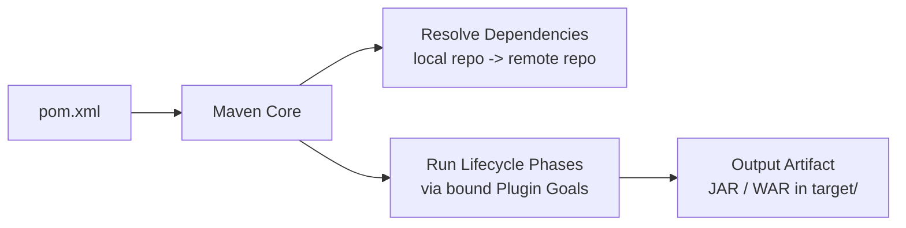
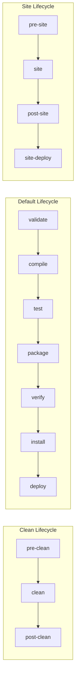
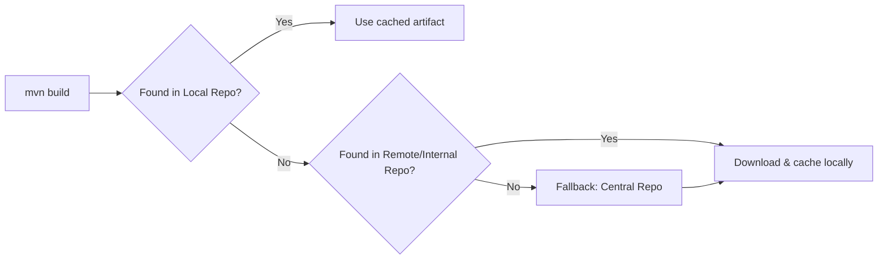
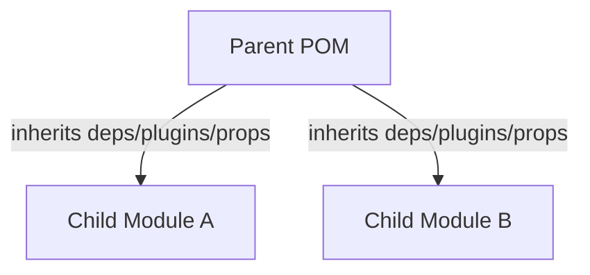

# Apache Maven — Interview Q&A Notes

---

## Table of Contents
1. [What is Maven & how does it work?](#1-what-is-maven--how-does-it-work)
2. [What aspects does Maven manage?](#2-what-aspects-does-maven-manage)
3. [3 Build Lifecycles of Maven](#3-3-build-lifecycles-of-maven)
4. [What is POM?](#4-what-is-pom)
5. [What is a Maven Artifact?](#5-what-is-a-maven-artifact)
6. [Maven Repositories & Their Types](#6-maven-repositories--their-types)
7. [Why Maven Plugins?](#7-why-maven-plugins)
8. [Dependency Scopes in Maven](#8-dependency-scopes-in-maven)
9. [How are Profiles Specified in Maven?](#9-how-are-profiles-specified-in-maven)
10. [How to Exclude a Dependency](#10-how-to-exclude-a-dependency)
11. [Apache Ant vs Maven](#11-apache-ant-vs-maven)
12. [Maven's 2 Settings Files & Their Locations](#12-mavens-2-settings-files--their-locations)
13. [What is a Build Phase?](#13-what-is-a-build-phase)
14. [Where to Find Class Files After Compiling](#14-where-to-find-class-files-after-compiling)
15. [What Does `jar:jar` Do?](#15-what-does-jarjar-do)
16. [Maven's Inheritance](#16-mavens-inheritance)
17. [POM Minimum Required Elements](#17-pom-minimum-required-elements)
18. [Producing Debug / Error Output During Build](#18-producing-debug--error-output-during-build)
19. [How to Run Test Classes in Maven](#19-how-to-run-test-classes-in-maven)

---

## 1. What is Maven & how does it work?

**Theory**
Apache Maven is a **build automation and project management tool**, primarily for Java projects. It is based on the concept of a **Project Object Model (POM)** — an XML file (`pom.xml`) that describes the project, its dependencies, plugins, and build configuration.

**How it works (step by step):**
1. Maven reads `pom.xml` to understand project coordinates, dependencies, and plugin config.
2. It resolves **dependencies** — checking the local repo (`~/.m2`) first, then falling back to remote/central repositories, downloading and caching anything missing.
3. It executes the **build lifecycle** — a fixed sequence of phases (validate, compile, test, package, etc.) — where each phase runs the **plugin goals** bound to it.
4. It produces a final **artifact** (JAR/WAR/EAR) in the `target/` directory.

Maven follows **"Convention over Configuration"** — if you follow the standard directory layout (`src/main/java`, `src/test/java`, etc.), you need almost no extra configuration.



---

## 2. What aspects does Maven manage?

Maven manages:
- **Build** — compiling, packaging, testing
- **Dependencies** — downloading, versioning, transitive dependency resolution
- **Documentation** — project site generation (`mvn site`)
- **Reporting** — test reports (Surefire reports), code coverage, etc.
- **Distribution / Publishing** — deploying artifacts to remote repos (`mvn deploy`)
- **SCM integration** — tagging/releasing via the Maven Release Plugin
- **Project structure** — enforces a standard, predictable directory layout across projects

---

## 3. 3 Build Lifecycles of Maven

Maven has exactly **3 built-in lifecycles**, each made up of an ordered sequence of phases:

| Lifecycle | Key Phases |
|---|---|
| **clean** | `pre-clean` → `clean` → `post-clean` |
| **default** (build) | `validate` → `compile` → `test` → `package` → `verify` → `install` → `deploy` |
| **site** | `pre-site` → `site` → `post-site` → `site-deploy` |



> Each lifecycle is independent — running `mvn install` does **not** trigger `clean`, which is why `mvn clean install` is commonly run together.

---

## 4. What is POM?

**POM = Project Object Model** — the `pom.xml` file at the root of a Maven project. It's an XML descriptor that defines:
- Project coordinates (`groupId`, `artifactId`, `version`)
- Dependencies
- Plugins & their configuration
- Build settings, profiles, properties

Example minimal `pom.xml`:
```xml
<project xmlns="http://maven.apache.org/POM/4.0.0">
    <modelVersion>4.0.0</modelVersion>
    <groupId>com.example</groupId>
    <artifactId>myapp</artifactId>
    <version>1.0.0</version>
</project>
```

---

## 5. What is a Maven Artifact?

An **artifact** is the output produced by a Maven build — typically a JAR, WAR, EAR, or POM file — uniquely identified by its **GAV coordinates**:
- **G**roupId — e.g. `com.example`
- **A**rtifactId — e.g. `myapp`
- **V**ersion — e.g. `1.0.0`

Once built, the artifact is stored in a repository (local or remote) so other projects can declare it as a dependency:
```xml
<dependency>
    <groupId>com.example</groupId>
    <artifactId>myapp</artifactId>
    <version>1.0.0</version>
</dependency>
```

---

## 6. Maven Repositories & Their Types

| Type | Location | Description |
|---|---|---|
| **Local Repository** | `~/.m2/repository` (or `$HOME/.m2`) | Cache on the developer's machine; Maven always checks here first |
| **Central Repository** | repo.maven.apache.org | Default public repository maintained by the Maven community; fallback if not found locally/internally |
| **Remote Repository** | Custom URL (e.g. Nexus, Artifactory, JFrog) | Company/team-hosted repo for internal or third-party artifacts not on Central |

**Resolution order:** Local → configured Remote repo(s) → Central (as ultimate fallback).



---

## 7. Why Maven Plugins?

Maven's core engine, by itself, doesn't know how to compile code, run tests, or package a JAR — **all real work in Maven is performed by plugins**. Each plugin exposes one or more **goals**, and goals are bound to lifecycle phases.

Examples:
| Plugin | Goal | Bound Phase | Purpose |
|---|---|---|---|
| `maven-compiler-plugin` | `compile` | `compile` | Compiles `.java` → `.class` |
| `maven-surefire-plugin` | `test` | `test` | Runs unit tests |
| `maven-jar-plugin` | `jar` | `package` | Packages classes into a `.jar` |
| `maven-war-plugin` | `war` | `package` | Packages a web app into a `.war` |

So Maven is essentially a **plugin execution framework** orchestrated by the lifecycle.

---

## 8. Dependency Scopes in Maven

| Scope | Available at Compile | Available at Runtime | Packaged in Artifact | Example Use |
|---|---|---|---|---|
| `compile` *(default)* | ✅ | ✅ | ✅ | Most regular libraries |
| `provided` | ✅ | ✅ (container supplies it) | ❌ | `servlet-api`, `lombok` |
| `runtime` | ❌ | ✅ | ✅ | JDBC drivers |
| `test` | ✅ (test code only) | ❌ | ❌ | JUnit, Mockito |
| `system` | ✅ | ✅ | ❌ | Local jar via `<systemPath>` (rarely used) |
| `import` | N/A | N/A | N/A | Only used in `<dependencyManagement>` with `pom` type, for BOM imports |

```xml
<dependency>
    <groupId>javax.servlet</groupId>
    <artifactId>javax.servlet-api</artifactId>
    <version>4.0.1</version>
    <scope>provided</scope>
</dependency>
```

---

## 9. How are Profiles Specified in Maven?

**Profiles** let you customize the build for different environments (dev, test, prod) — they can be defined in `pom.xml` or `settings.xml`.

```xml
<profiles>
    <profile>
        <id>dev</id>
        <activation>
            <activeByDefault>true</activeByDefault>
        </activation>
        <properties>
            <env>development</env>
        </properties>
    </profile>
    <profile>
        <id>prod</id>
        <properties>
            <env>production</env>
        </properties>
    </profile>
</profiles>
```

**Activation methods:**
- Explicitly via CLI: `mvn package -Pprod`
- `activeByDefault` — active unless another profile is explicitly activated
- Based on a system property: `<property><name>env</name><value>prod</value></property>`
- Based on JDK version or OS: `<jdk>1.8</jdk>` or `<os><family>windows</family></os>`

---

## 10. How to Exclude a Dependency

Use `<exclusions>` inside a `<dependency>` block to prevent an unwanted **transitive dependency** from being pulled in (common to resolve version conflicts or remove unused/duplicate libraries).

```xml
<dependency>
    <groupId>org.springframework</groupId>
    <artifactId>spring-core</artifactId>
    <version>5.3.0</version>
    <exclusions>
        <exclusion>
            <groupId>commons-logging</groupId>
            <artifactId>commons-logging</artifactId>
        </exclusion>
    </exclusions>
</dependency>
```
> Use `mvn dependency:tree` first to identify which transitive dependency is causing the conflict before excluding it.

---

## 11. Apache Ant vs Maven

| Aspect | Apache Ant | Maven |
|---|---|---|
| Build style | **Procedural** — you write every step explicitly | **Declarative** — you describe *what* the project is, Maven figures out *how* to build it |
| Config file | `build.xml` | `pom.xml` |
| Convention | No standard structure — fully customizable | Enforces a **standard directory layout** |
| Dependency management | None built-in (needs Apache Ivy add-on) | **Built-in**, with transitive dependency resolution |
| Lifecycle | No fixed lifecycle — you define targets/tasks yourself | Fixed, well-defined lifecycle (validate→...→deploy) |
| Reusability | Targets are project-specific, less reusable | Plugins are reusable across projects via Maven Central |
| Learning curve | Simpler concept, but more manual scripting | Slightly steeper, but far less boilerplate for standard projects |

> **In short:** Ant tells the build tool *how* to do each step (like a script); Maven tells it *what* the project is and follows convention for *how*.

---

## 12. Maven's 2 Settings Files & Their Locations

| Settings File | Location | Scope |
|---|---|---|
| **Global `settings.xml`** | `${maven.home}/conf/settings.xml` (Maven installation directory) | Applies to **all users** on that machine |
| **User `settings.xml`** | `${user.home}/.m2/settings.xml` (e.g. `~/.m2/settings.xml`) | Applies to **only the current user**; overrides global settings |

These files configure things like local repo path, remote repository mirrors, server credentials, and proxy settings — **not** project-specific build info (that's `pom.xml`'s job).

---

## 13. What is a Build Phase?

A **build phase** represents a distinct stage in a Maven lifecycle (e.g. `compile`, `test`, `package`). Each phase is responsible for a specific step of the build and consists of an ordered list of **plugin goals** bound to it.

Example — default lifecycle phases (simplified):
| Phase | What Happens |
|---|---|
| `validate` | Validate the project is correct, all info is available |
| `compile` | Compile the source code |
| `test` | Run unit tests using a testing framework |
| `package` | Package compiled code into JAR/WAR |
| `verify` | Run checks on results of integration tests |
| `install` | Install the package into the local repo |
| `deploy` | Copy the package to a remote repo for sharing |

Running `mvn <phase>` executes that phase **and every phase before it** in the same lifecycle.

---

## 14. Where to Find Class Files After Compiling

After running `mvn compile` (or any later phase), compiled `.class` files are placed in:

```
target/classes/         → compiled MAIN source classes (from src/main/java)
target/test-classes/    → compiled TEST source classes (from src/test/java)
```

The final packaged artifact (e.g. `target/myapp-1.0.0.jar`) is produced later, in the `package` phase.

---

## 15. What Does `jar:jar` Do?

`jar:jar` refers to the **`jar` goal of the `maven-jar-plugin`**. It is bound to the **`package`** phase by default for `jar`-packaged projects.

**What it does:**
- Takes the compiled classes and resources from `target/classes`
- Bundles them into a single `.jar` file
- Places the resulting JAR in the `target/` directory (e.g. `target/myapp-1.0.0.jar`)

You can invoke it directly without running the full lifecycle:
```bash
mvn jar:jar
```

---

## 16. Maven's Inheritance

Maven supports **POM inheritance** via the `<parent>` element — a child POM inherits configuration (dependencies, plugins, properties, profiles) from a parent POM, reducing duplication across multi-module projects.

```xml
<!-- child pom.xml -->
<parent>
    <groupId>com.example</groupId>
    <artifactId>parent-project</artifactId>
    <version>1.0.0</version>
    <relativePath>../parent-project/pom.xml</relativePath>
</parent>
```

**Two key inheritance-management elements in the parent:**
- `<dependencyManagement>` — declares dependency *versions* centrally; children inherit version without redeclaring it
- `<pluginManagement>` — same idea, but for plugin versions/config



> This is distinct from **aggregation** (`<modules>` in a parent POM listing sub-modules to build together) — inheritance is about *configuration*, aggregation is about *build orchestration*. The two are often combined in multi-module projects but are conceptually different.

---

## 17. POM Minimum Required Elements

A valid `pom.xml` must contain at minimum:
- `<project>` — root element (with xmlns/schema attributes)
- `<modelVersion>` — always `4.0.0` for current Maven
- `<groupId>` — organization/group identifier
- `<artifactId>` — project/module name
- `<version>` — project version

```xml
<project xmlns="http://maven.apache.org/POM/4.0.0">
    <modelVersion>4.0.0</modelVersion>
    <groupId>com.example</groupId>
    <artifactId>myapp</artifactId>
    <version>1.0.0</version>
</project>
```
> `packaging` is optional and defaults to `jar` if omitted.

---

## 18. Producing Debug / Error Output During Build

Maven CLI flags to control output verbosity:

| Flag | Effect |
|---|---|
| `-X` or `--debug` | Full **debug** output (very verbose, shows plugin internals) |
| `-e` or `--errors` | Show full **stack traces** for errors |
| `-q` or `--quiet` | Suppress most output, show only essential info/errors |
| `-X -e` (combined) | Maximum detail — debug logs + full error stack traces |

```bash
mvn clean install -X        # full debug output
mvn clean install -e        # show error stack traces on failure
mvn clean install -X -e     # both combined
```

---

## 19. How to Run Test Classes in Maven

Tests are run via the **`maven-surefire-plugin`**, bound to the `test` phase.

| Command | Effect |
|---|---|
| `mvn test` | Runs **all** test classes |
| `mvn test -Dtest=MyClassTest` | Runs only the specified test class |
| `mvn test -Dtest=MyClassTest#myTestMethod` | Runs only a specific test method |
| `mvn install -DskipTests` | Skips running tests, but still **compiles** them |
| `mvn install -Dmaven.test.skip=true` | Skips both compiling **and** running tests |

```bash
mvn test -Dtest=UserServiceTest
mvn test -Dtest=UserServiceTest#shouldCreateUser
```

---
*Structured Maven interview reference — diagrams render automatically as Mermaid on GitHub.*
