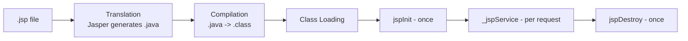
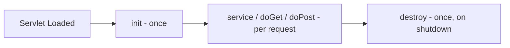
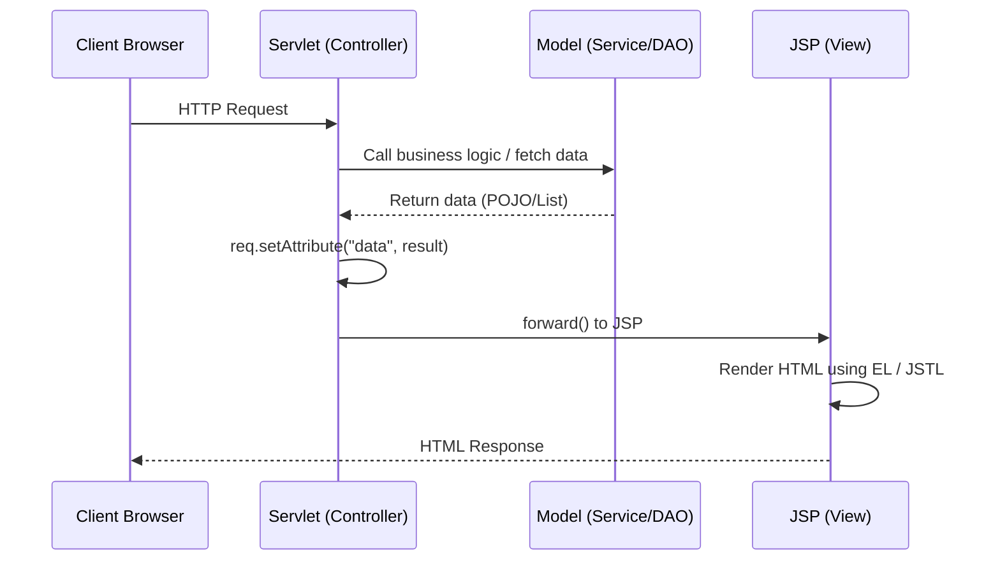

# JSP, Servlets, MVC & Maven — Interview Notes

---

## Table of Contents
1. [Role of JSP](#1-role-of-jsp)
2. [Servlet Functionality](#2-servlet-functionality)
3. [JSP & Servlets in MVC Architecture](#3-jsp--servlets-in-mvc-architecture)
4. [JSP Features & Components](#4-jsp-features--components)
5. [Advantages of Using Servlet & JSP](#5-advantages-of-using-servlet--jsp)
6. [Taglib Directive](#6-taglib-directive)
7. [Apache Maven](#7-apache-maven)

---

## 1. Role of JSP

### Theory
**JSP (JavaServer Pages)** is a server-side technology used to create dynamic, platform-independent web content by embedding Java logic directly into HTML-like markup. Its primary role in a web app is to act as the **presentation/view layer** — generating the actual HTML sent back to the browser.

Under the hood, a JSP is never executed directly — it is **translated into a servlet** by the container's JSP engine (Jasper, in Tomcat) the first time it's requested (or at deploy time if pre-compiled).

### JSP Lifecycle
1. **Translation** — `.jsp` file → generated `_jsp.java` servlet source
2. **Compilation** — `.java` → `.class`
3. **Class loading & Instantiation**
4. **Initialization** — `jspInit()` called once
5. **Execution** — `_jspService()` called for **every request**
6. **Destruction** — `jspDestroy()` called once before unload



### Example
```jsp
<%@ page contentType="text/html;charset=UTF-8" %>
<html>
<body>
  <h2>Welcome, ${user.name}!</h2>
  <p>Today's date: <%= new java.util.Date() %></p>
</body>
</html>
```

### Interview points
- JSP is essentially "syntactic sugar" over a servlet — it gets compiled into one.
- `jspInit()`/`jspDestroy()` are JSP-specific equivalents of a servlet's `init()`/`destroy()`.

---

## 2. Servlet Functionality

### Theory
A **Servlet** is a Java class that runs inside a servlet container and handles HTTP requests/responses. It is the **controller/logic layer** in a typical web app — receiving requests, executing business logic (often delegating to service/DAO classes), and producing a response (directly, or by forwarding to a JSP view).

### Servlet Lifecycle
1. **`init()`** — called once, when the servlet is first loaded
2. **`service()`** → dispatches to `doGet()`, `doPost()`, `doPut()`, `doDelete()`, etc. — called **once per request**
3. **`destroy()`** — called once before the servlet is unloaded



### Example
```java
@WebServlet("/login")
public class LoginServlet extends HttpServlet {

    @Override
    public void init() {
        System.out.println("LoginServlet initialized");
    }

    @Override
    protected void doPost(HttpServletRequest req, HttpServletResponse resp)
            throws ServletException, IOException {
        String username = req.getParameter("username");
        String password = req.getParameter("password");

        boolean valid = authService.validate(username, password);

        if (valid) {
            req.getSession().setAttribute("user", username);
            resp.sendRedirect("dashboard.jsp");
        } else {
            req.setAttribute("error", "Invalid credentials");
            req.getRequestDispatcher("login.jsp").forward(req, resp);
        }
    }
}
```

### Interview points
- A single servlet **instance** handles many requests concurrently via a thread pool — instance fields must be used carefully (thread-safety).
- `forward()` (server-side, same request) vs `sendRedirect()` (new client request) — common follow-up question.

---

## 3. JSP & Servlets in MVC Architecture

### Theory
The classic **Model-View-Controller (MVC)** pattern maps cleanly onto Servlets and JSP:

| MVC Role | Implemented by |
|---|---|
| **Model** | Plain Java classes — JavaBeans, DAOs, service classes holding data & business logic |
| **View** | **JSP** — renders the HTML output using data passed from the controller |
| **Controller** | **Servlet** — receives the request, invokes the model, decides which view to render |

### Flow


### Example — Controller forwarding to View
```java
@WebServlet("/products")
public class ProductServlet extends HttpServlet {
    protected void doGet(HttpServletRequest req, HttpServletResponse resp)
            throws ServletException, IOException {
        List<Product> products = productService.findAll();   // Model
        req.setAttribute("products", products);
        req.getRequestDispatcher("/productList.jsp").forward(req, resp); // View
    }
}
```
```jsp
<%-- productList.jsp (View) --%>
<%@ taglib uri="http://java.sun.com/jsp/jstl/core" prefix="c" %>
<table>
  <c:forEach var="p" items="${products}">
    <tr><td>${p.name}</td><td>${p.price}</td></tr>
  </c:forEach>
</table>
```

### Interview points
- This pattern is sometimes called **"Model 2"** architecture (vs "Model 1" where JSP alone handles both logic and view — discouraged).
- Benefits: separation of concerns, easier testing of business logic independent of the web layer, designers can work on JSP without touching Java code.

---

## 4. JSP Features & Components

### Key Features
- Automatically compiled into a servlet by the container (Jasper)
- Combines HTML markup with dynamic Java content
- Provides **implicit objects** — no need to declare them manually
- Supports **Expression Language (EL)** and **JSTL** for tag-based, scriptlet-free coding
- Platform-independent (runs on any Servlet/JSP-compliant container)

### Implicit Objects
| Object | Type | Purpose |
|---|---|---|
| `request` | `HttpServletRequest` | Current request data |
| `response` | `HttpServletResponse` | Current response |
| `session` | `HttpSession` | User session |
| `application` | `ServletContext` | App-wide shared data |
| `out` | `JspWriter` | Output stream to client |
| `config` | `ServletConfig` | Servlet configuration |
| `pageContext` | `PageContext` | Access to all other scopes |
| `exception` | `Throwable` | Available only on error pages |

### Components / Building Blocks
```mermaid
graph TD
    JSP[JSP Page] --> Dir[Directives\npage, include, taglib]
    JSP --> Script[Scripting Elements\ndeclaration, scriptlet, expression]
    JSP --> Action[Standard Actions\njsp:include, jsp:forward, jsp:useBean]
    JSP --> EL[Expression Language\n${...}]
    JSP --> JSTL[JSTL Tags\nc:forEach, c:if, c:choose]
    JSP --> Comment[Comments\n<%-- --%>]
```

**Directives**
```jsp
<%@ page import="java.util.*" %>
<%@ include file="header.jsp" %>
<%@ taglib uri="http://java.sun.com/jsp/jstl/core" prefix="c" %>
```

**Scripting elements**
```jsp
<%! int counter = 0; %>            <%-- declaration --%>
<% counter++; %>                    <%-- scriptlet --%>
<%= counter %>                      <%-- expression --%>
```

**Standard actions**
```jsp
<jsp:useBean id="user" class="com.example.User" scope="session"/>
<jsp:setProperty name="user" property="name" value="John"/>
<jsp:include page="footer.jsp"/>
<jsp:forward page="result.jsp"/>
```

**Expression Language (EL)**
```jsp
<p>Hello, ${user.name}! You have ${cart.itemCount} items.</p>
```

### Interview points
- EL/JSTL exist specifically to **eliminate Java scriptlets** from JSP, keeping views clean (best practice: avoid `<% %>` in modern JSP).
- `jsp:useBean` ties into JavaBean conventions (no-arg constructor + getters/setters).

---

## 5. Advantages of Using Servlet & JSP

### Servlet advantages
- **Platform-independent** — pure Java, runs on any compliant container
- **Efficient & scalable** — single servlet instance handles many requests via threads (unlike CGI, which spawns a new OS process per request)
- **Robust** — benefits from JVM's memory management, garbage collection, and exception handling
- **Secure** — no direct memory access, integrates with Java's security model
- **Rich ecosystem integration** — JDBC, JNDI, JPA, JMS, etc.

### JSP advantages
- **Separation of presentation from logic** when paired with servlets (MVC)
- **Easier for designers** — HTML-like syntax is far more approachable than building HTML via `out.println()` in a servlet
- **Reusable view components** via custom tags / JSTL
- **Automatic compilation** and **implicit objects** reduce boilerplate code

### Combined advantage (Servlet + JSP together)
- Clean separation of concerns: **Servlet = "what to do"**, **JSP = "how to display it"**
- Easier to maintain, test, and assign work between backend and frontend developers
- Standardized, well-documented, mature technology with broad container support (Tomcat, Jetty, WildFly, etc.)

---

## 6. Taglib Directive

### Theory
The **`taglib` directive** declares a **tag library** for use within a JSP page — mapping a URI to a **Tag Library Descriptor (TLD)** that defines available custom or standard tags (like JSTL's `<c:forEach>`). This is what enables tag-based logic in JSP instead of embedding raw Java scriptlets.

### Syntax
```jsp
<%@ taglib uri="http://java.sun.com/jsp/jstl/core" prefix="c" %>
```
- `uri` — identifies the tag library (mapped via `web.xml` or auto-discovered from the JAR's `META-INF/*.tld`)
- `prefix` — the namespace used to invoke tags from this library in the page, e.g. `c:`

### Using JSTL core tags (standard taglib)
```jsp
<%@ taglib uri="http://java.sun.com/jsp/jstl/core" prefix="c" %>

<c:if test="${user != null}">
    <p>Welcome back, ${user.name}!</p>
</c:if>

<c:forEach var="item" items="${cartItems}">
    <li>${item.name} - ${item.price}</li>
</c:forEach>

<c:choose>
    <c:when test="${score >= 90}">Grade: A</c:when>
    <c:otherwise>Grade: B or lower</c:otherwise>
</c:choose>
```

### Custom taglib (your own tag)
**1. Tag handler class**
```java
public class HelloTag extends SimpleTagSupport {
    @Override
    public void doTag() throws IOException {
        getJspContext().getOut().write("Hello from custom tag!");
    }
}
```
**2. TLD descriptor (`hello.tld`)**
```xml
<taglib>
    <tlib-version>1.0</tlib-version>
    <short-name>hello</short-name>
    <tag>
        <name>greet</name>
        <tag-class>com.example.tags.HelloTag</tag-class>
        <body-content>empty</body-content>
    </tag>
</taglib>
```
**3. Usage in JSP**
```jsp
<%@ taglib uri="/WEB-INF/hello.tld" prefix="h" %>
<h:greet/>
```

### Flow diagram


### Interview points
- JSTL is the **standard** taglib (core, fmt for formatting, sql, xml) bundled to avoid scriptlets entirely.
- Custom taglibs are useful for reusable, complex view logic (pagination components, formatted widgets, etc.) without polluting JSPs with Java code.

---

## 7. Apache Maven

### Theory
**Apache Maven** is the build automation and dependency management tool most commonly used to build, package, and deploy Servlet/JSP web applications as WAR files. It uses a `pom.xml` (Project Object Model) to declare dependencies, plugins, and build configuration, and resolves libraries automatically from repositories instead of requiring manual JAR management.

### How it ties into JSP/Servlet projects
```xml
<packaging>war</packaging>

<dependencies>
    <dependency>
        <groupId>javax.servlet</groupId>
        <artifactId>javax.servlet-api</artifactId>
        <version>4.0.1</version>
        <scope>provided</scope>
    </dependency>
    <dependency>
        <groupId>javax.servlet.jsp.jstl</groupId>
        <artifactId>jstl</artifactId>
        <version>1.2</version>
    </dependency>
</dependencies>

<build>
    <finalName>myapp</finalName>
    <plugins>
        <plugin>
            <groupId>org.apache.maven.plugins</groupId>
            <artifactId>maven-war-plugin</artifactId>
            <version>3.4.0</version>
        </plugin>
    </plugins>
</build>
```

### Build & deploy flow


### Why Maven matters here
- Manages the **Servlet API / JSTL** dependencies with correct scope (`provided` for container-supplied APIs)
- Standardizes the **directory layout** (`src/main/webapp`, `WEB-INF/web.xml`)
- Produces a **deployable WAR** in one command (`mvn clean package`)
- Supports running the app locally via plugins (`mvn tomcat7:run` / `cargo:run`) without manual server setup

### Interview points
- `provided` scope is essential here — the servlet container (Tomcat) already supplies the Servlet/JSP API at runtime, so it must be excluded from the packaged WAR.
- Maven's standard webapp layout (`src/main/webapp/WEB-INF/web.xml`) is what makes JSP/Servlet projects portable and IDE-agnostic.

---
*Structured JSP/Servlet/MVC/Maven interview reference — diagrams render automatically as Mermaid on GitHub.*
