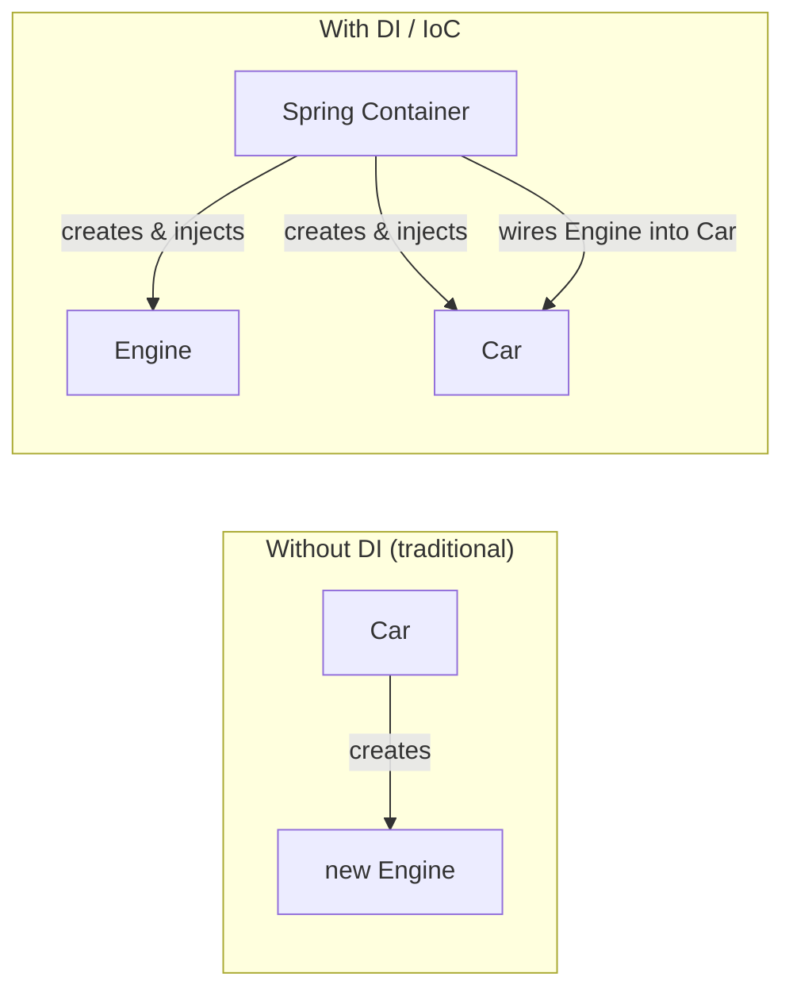
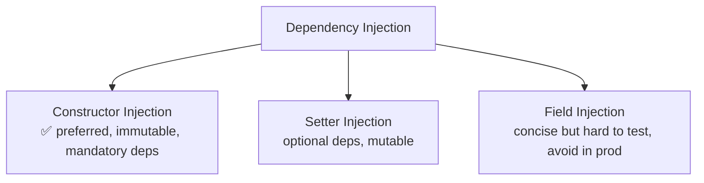
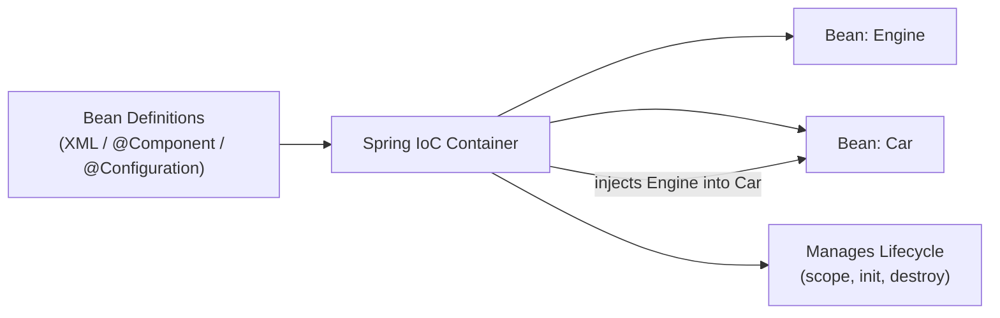

# Dependency Injection & Spring IoC — Interview Notes

---

## Table of Contents
1. [Dependency Injection (DI) — Overview](#1-dependency-injection-di--overview)
2. [Constructor Injection](#2-constructor-injection)
3. [Setter Injection](#3-setter-injection)
4. [Field Injection](#4-field-injection)
5. [Comparison of Injection Types](#5-comparison-of-injection-types)
6. [Advantages of Spring Inversion of Control (IoC)](#6-advantages-of-spring-inversion-of-control-ioc)
7. [Full Code Example — All Pieces Together](#7-full-code-example--all-pieces-together)

---

## 1. Dependency Injection (DI) — Overview

### Theory
**Dependency Injection (DI)** is a design pattern where an object's dependencies are **provided to it from the outside** rather than the object creating them itself. It's the practical implementation of the broader principle called **Inversion of Control (IoC)** — control over object creation and wiring is "inverted" from the application code to a container/framework (in Spring, the **Spring IoC Container** / `ApplicationContext`).

### Without DI vs With DI

```java
// ❌ WITHOUT DI — tight coupling, Car creates its own dependency
class Car {
    private Engine engine = new Engine();   // hard-coded dependency
}

// ✅ WITH DI — loose coupling, dependency is supplied externally
class Car {
    private final Engine engine;
    public Car(Engine engine) {             // dependency injected
        this.engine = engine;
    }
}
```

### Diagram — Control flow inversion



### The 3 ways to inject a dependency in Spring
1. **Constructor Injection**
2. **Setter Injection**
3. **Field Injection**

---

## 2. Constructor Injection

### Theory
Dependencies are supplied through the **class constructor**. Spring resolves and passes the required beans when it constructs the object — meaning the object is **fully initialized** with all its mandatory dependencies the moment it's created.

### Annotation-based example
```java
@Component
class Engine {
    public void start() {
        System.out.println("Engine starting...");
    }
}

@Component
class Car {
    private final Engine engine;

    @Autowired                          // optional if there's only one constructor (Spring 4.3+)
    public Car(Engine engine) {
        this.engine = engine;
    }

    public void drive() {
        engine.start();
        System.out.println("Car is driving");
    }
}
```

### XML-based config equivalent
```xml
<bean id="engine" class="com.example.Engine"/>
<bean id="car" class="com.example.Car">
    <constructor-arg ref="engine"/>
</bean>
```

### Pros
- Supports **immutability** — dependency fields can be declared `final`
- Guarantees the object is **never in a partially-constructed/invalid state**
- Makes **mandatory dependencies explicit** in the class's public API
- Easiest to unit test — just call `new Car(mockEngine)`, no Spring container needed

### Cons
- A constructor with too many parameters (5+) is often a **code smell**, signaling the class may be doing too much (violating Single Responsibility Principle)

> ✅ **This is the officially recommended approach by the Spring team for mandatory dependencies.**

---

## 3. Setter Injection

### Theory
Dependencies are supplied via **public setter methods** after the object has already been constructed (typically via a no-arg constructor).

### Annotation-based example
```java
@Component
class Car {
    private Engine engine;

    @Autowired
    public void setEngine(Engine engine) {
        this.engine = engine;
    }
}
```

### XML-based config equivalent
```xml
<bean id="car" class="com.example.Car">
    <property name="engine" ref="engine"/>
</bean>
```

### Pros
- Good fit for **optional dependencies** (can have sensible defaults, set only if available)
- Dependencies can be **reconfigured/changed** after the bean is created
- More readable when a class has many optional configurable properties

### Cons
- Object can exist in a **partially initialized state** until all setters are called
- Fields can't be `final` → less immutability, more room for accidental reassignment
- Required dependencies aren't enforced at compile/construction time — a missing setter call only fails at runtime (often as a `NullPointerException`)

---

## 4. Field Injection

### Theory
The dependency is injected **directly into the field** using reflection — Spring sets the private field's value without going through a constructor or setter.

### Example
```java
@Component
class Car {
    @Autowired
    private Engine engine;   // injected directly via reflection
}
```

### Pros
- **Least boilerplate** — no constructor, no setter, just an annotation
- Looks clean and concise in small examples/demos

### Cons (why it's generally discouraged in production code)
- Field **cannot be `final`** → no immutability
- **Hard to unit test outside Spring** — you can't simply do `new Car()` and pass a mock; you need reflection or a Spring test context
- **Hides dependencies** — a class's required collaborators aren't visible from its constructor/public API, making the code harder to reason about
- Violates the **Explicit Dependencies Principle**
- The Spring team itself recommends **avoiding field injection** in real applications — it's mainly seen in tutorials/quick demos

---

## 5. Comparison of Injection Types

| Aspect | Constructor Injection | Setter Injection | Field Injection |
|---|---|---|---|
| Mechanism | Via constructor args | Via setter methods | Via reflection on field |
| Immutability (`final`) | ✅ Supported | ❌ Not possible | ❌ Not possible |
| Mandatory vs Optional deps | Best for **mandatory** | Best for **optional** | No distinction |
| Object validity guarantee | Fully valid object on creation | Possible partial state | Possible partial state |
| Unit testability | ✅ Best — plain `new` | Good | ❌ Poor without Spring |
| Dependency visibility | ✅ Explicit in API | Partially visible | ❌ Hidden |
| Spring team recommendation | ✅ **Preferred** | Use for optional deps | ⚠️ Avoid in production |



---

## 6. Advantages of Spring Inversion of Control (IoC)

### Theory
The **Spring IoC Container** (`BeanFactory` / `ApplicationContext`) is responsible for instantiating, configuring, wiring, and managing the complete lifecycle of application objects ("beans"), based on configuration metadata (XML, annotations, or Java config).

### Key advantages
- **Loose coupling** — classes depend on abstractions/interfaces, not concrete implementations created internally
- **Centralized configuration** — all bean wiring is defined in one place (XML/`@Configuration`/component scanning) instead of scattered across the codebase
- **Easier unit testing** — dependencies can be swapped for mocks/stubs without touching the class under test
- **Promotes interface-based, Open/Closed-compliant design** — swap an implementation without changing dependent code
- **Lifecycle management** — container handles bean creation order, scopes (`singleton`, `prototype`, `request`, `session`), init/destroy callbacks
- **Reduced boilerplate** — no manual `new` chains for wiring up an entire object graph
- **Enables other Spring features built on top of IoC** — AOP (proxies for `@Transactional`, logging, security), declarative configuration, auto-configuration in Spring Boot

### Diagram — IoC Container responsibility



### Interview points
- **IoC** is the *principle* (control of object creation is inverted to a container); **DI** is the *pattern/technique* used to implement it.
- Other IoC implementations exist (Service Locator pattern, Factory pattern) — DI is simply the most common and Spring's primary mechanism.

---

## 7. Full Code Example — All Pieces Together

### Java-based configuration (`@Configuration` + `@Bean`) — manual wiring, no component scanning
```java
@Configuration
class AppConfig {

    @Bean
    public Engine engine() {
        return new Engine();
    }

    @Bean
    public Car car(Engine engine) {
        return new Car(engine);          // constructor injection via config method param
    }
}
```

### Annotation-driven (component scanning) — most common in real apps
```java
@Component
class Engine {
    public void start() {
        System.out.println("Engine starting...");
    }
}

@Component
class Car {
    private final Engine engine;        // constructor injection (preferred)

    @Autowired
    public Car(Engine engine) {
        this.engine = engine;
    }

    public void drive() {
        engine.start();
        System.out.println("Driving the car!");
    }
}

@SpringBootApplication
public class DemoApp {
    public static void main(String[] args) {
        ApplicationContext context = SpringApplication.run(DemoApp.class, args);
        Car car = context.getBean(Car.class);   // IoC container hands you the fully wired bean
        car.drive();
    }
}
```

**Output**
```
Engine starting...
Driving the car!
```

> Notice: nowhere did application code write `new Car(new Engine())` — the **Spring IoC Container** did the wiring. That's Inversion of Control in action, implemented via Dependency Injection.

---
*Structured Spring DI & IoC interview reference — diagrams render automatically as Mermaid on GitHub.*
