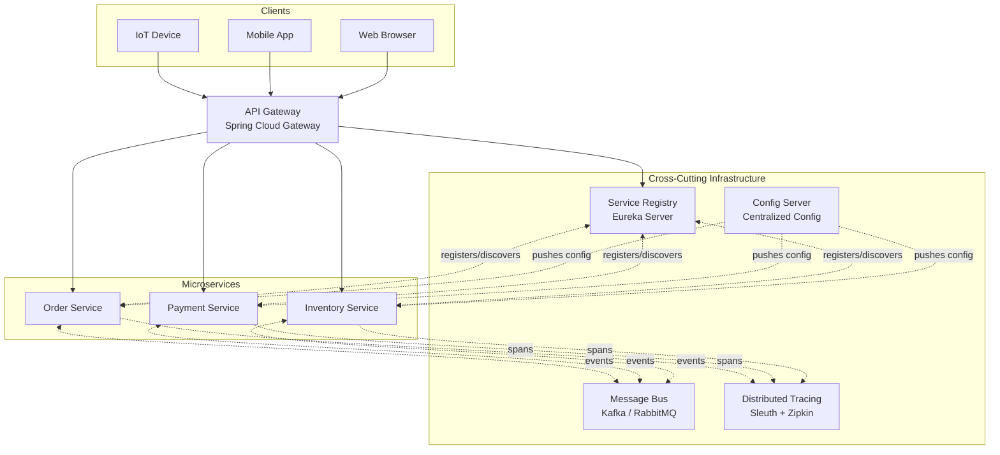
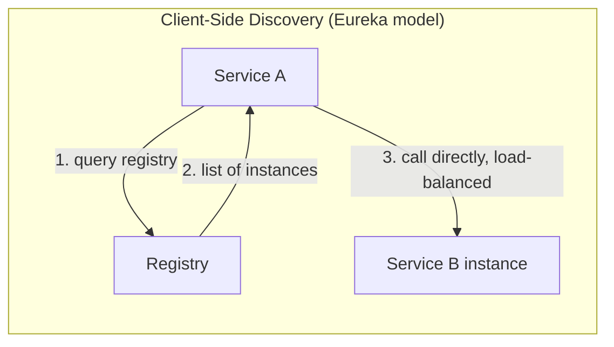
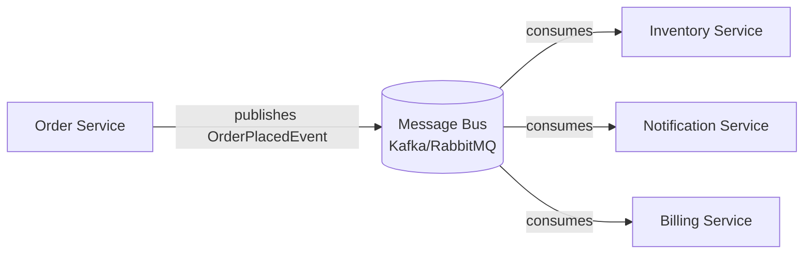
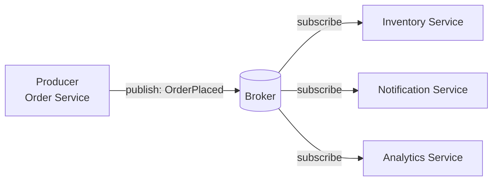
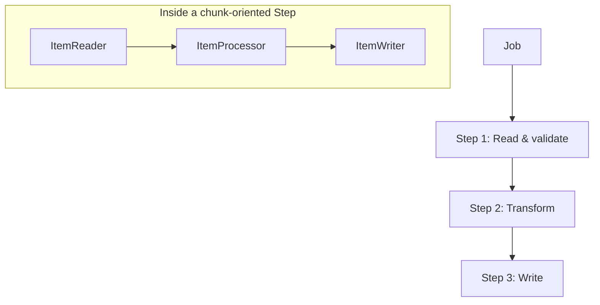

# Spring Cloud & Microservices Architecture — Interview Notes

> Companion notes to: Spring Initializr → Microservices → Spring Cloud building blocks → Reactive → Cloud-Native → Serverless → Event-Driven → Batch

---

## Table of Contents

1. [Spring Initializr](#1-spring-initializr)
2. [Microservices — What & Why](#2-microservices--what--why)
3. [Spring Cloud Architecture (Full Picture)](#3-spring-cloud-architecture-full-picture)
4. [Core Spring Cloud Components](#4-core-spring-cloud-components)
   - [4.1 API Gateway](#41-api-gateway)
   - [4.2 Service Registry & Discovery (Eureka)](#42-service-registry--discovery-eureka)
   - [4.3 Config Server](#43-config-server)
   - [4.4 Message Bus](#44-message-bus)
   - [4.5 Distributed Tracing](#45-distributed-tracing)
5. [Reactive Programming — Spring WebFlux](#5-reactive-programming--spring-webflux)
6. [Cloud-Native Applications](#6-cloud-native-applications)
   - [6.1 12-Factor App Principles](#61-12-factor-app-principles)
   - [6.2 Externalized Configuration](#62-externalized-configuration)
   - [6.3 Statelessness](#63-statelessness)
   - [6.4 Logging & Backing Services](#64-logging--backing-services)
7. [Serverless](#7-serverless)
8. [Event-Driven Architecture](#8-event-driven-architecture)
9. [Spring Batch](#9-spring-batch)
10. [Comparison Tables](#10-comparison-tables)
11. [Interview Q&A](#11-interview-qa)

---

## 1. Spring Initializr

**What it is:** A web tool (https://start.spring.io) and IntelliJ/STS plugin that bootstraps a Spring Boot project — generates `pom.xml`/`build.gradle`, folder structure, and a runnable main class, based on the dependencies you pick (Web, JPA, Security, Cloud Eureka, Config Client, etc.).

**Why it matters (interview angle):**
- Removes manual boilerplate (no hand-writing POM dependency trees).
- Lets you pick **Spring Boot version** + **dependency versions** that are guaranteed compatible (managed via the Spring Boot BOM).
- Generates either Maven or Gradle, Java or Kotlin, jar or war packaging.
- CLI equivalent: `spring init -d=web,data-jpa -g=com.example -a=demo demo.zip`

**What Spring (the framework) gives you on top of plain Java:**
- **IoC / DI container** — object creation & wiring handled by the framework (`@Component`, `@Autowired`).
- **Auto-configuration** — Spring Boot inspects classpath and wires sensible defaults (e.g., add `spring-boot-starter-data-jpa` → it configures a `DataSource`, `EntityManager`, etc. automatically).
- **Embedded server** (Tomcat/Netty) — no need to deploy a WAR to an external server.
- **Production-ready features** — Actuator endpoints (`/health`, `/metrics`), externalized config, profiles.

---

## 2. Microservices — What & Why

**What:** An architectural style where an application is split into small, independently deployable services, each owning a single business capability and its own data store, communicating over the network (REST/gRPC/messaging) instead of in-process calls.

**Why (drivers):**
| Driver | Explanation |
|---|---|
| Independent deployability | Ship a fix to `OrderService` without redeploying `PaymentService` |
| Independent scalability | Scale only the bottleneck service (e.g., `SearchService` during a sale) |
| Technology heterogeneity | `RecommendationService` in Python/ML, `OrderService` in Java — pick the right tool |
| Fault isolation | One service crashing shouldn't take the whole app down (vs. a monolith where one bad thread can starve the JVM) |
| Team autonomy | Small teams own a service end-to-end ("you build it, you run it") |

**The cost (always mention this in interviews — shows maturity):**
- Network calls replace in-memory calls → latency, partial failures, need for retries/circuit breakers.
- Distributed data → no single ACID transaction across services → need Sagas/eventual consistency.
- Operational complexity → you now need service discovery, centralized config, distributed tracing, log aggregation (this is *exactly* why Spring Cloud exists — see Section 3).

---

## 3. Spring Cloud Architecture (Full Picture)

This is the diagram style most interviewers expect you to draw on a whiteboard — clients in front, gateway as the single entry point, a registry + config server as cross-cutting infra, and tracing wrapping everything.



**How to narrate this in an interview (script):**
1. A request comes from any client type (IoT/Mobile/Web) — the client doesn't know or care how many microservices exist behind the scenes.
2. It hits a single **API Gateway**, which is the only public-facing entry point. It handles routing, auth, rate-limiting.
3. The Gateway asks the **Service Registry** "where is `OrderService` running right now?" — because in the cloud, instances scale up/down and IPs change constantly.
4. The actual business logic lives in small **Microservices**, each independently deployable.
5. Every microservice pulls its configuration from a **Config Server** at startup instead of bundling config in the jar.
6. Services talk to each other **asynchronously** through a **Message Bus** for events that don't need an immediate response.
7. **Distributed Tracing** stitches together a single request's journey across all these hops into one trace ID, so you can debug "why was this checkout slow?" across five services.

---

## 4. Core Spring Cloud Components

### 4.1 API Gateway

**Role:** Single entry point for all client traffic. Centralizes cross-cutting concerns so individual services don't reimplement them.

**Responsibilities:**
- Routing requests to the correct downstream service
- Authentication / JWT validation
- Rate limiting & load shedding
- Request/response transformation
- Circuit breaking at the edge

**Example — Spring Cloud Gateway route config (`application.yml`):**
```yaml
spring:
  cloud:
    gateway:
      routes:
        - id: order-service
          uri: lb://ORDER-SERVICE          # lb:// = load-balanced via Eureka
          predicates:
            - Path=/api/orders/**
          filters:
            - StripPrefix=1
            - name: CircuitBreaker
              args:
                name: orderServiceCB
                fallbackUri: forward:/fallback/orders
```
`lb://ORDER-SERVICE` is the key idea: the Gateway doesn't hardcode an IP — it asks Eureka for a healthy instance of `ORDER-SERVICE` and load-balances across all registered instances.

### 4.2 Service Registry & Discovery (Eureka)

**Problem it solves:** In a static environment you'd hardcode `http://10.0.0.5:8080`. In the cloud, instances are ephemeral (autoscaling, container restarts) — IPs change constantly. Hardcoding breaks.

**How it works:**
- Every microservice **registers itself** with Eureka on startup (sends its name + host + port).
- It sends a **heartbeat** every ~30s to prove it's alive.
- Other services ask Eureka, "give me all healthy instances of `PAYMENT-SERVICE`," and then load-balance client-side (Ribbon/Spring Cloud LoadBalancer) across the returned list.

**Server side (`@EnableEurekaServer`):**
```java
@SpringBootApplication
@EnableEurekaServer
public class EurekaServerApplication {
    public static void main(String[] args) {
        SpringApplication.run(EurekaServerApplication.class, args);
    }
}
```

**Client side (`application.yml` in each microservice):**
```yaml
spring:
  application:
    name: order-service        # this is the name it registers under
eureka:
  client:
    service-url:
      defaultZone: http://localhost:8761/eureka/
  instance:
    prefer-ip-address: true
```

**Calling another service by logical name (not IP):**
```java
@FeignClient(name = "payment-service")     // resolved via Eureka
public interface PaymentClient {
    @PostMapping("/payments")
    PaymentResponse pay(@RequestBody PaymentRequest request);
}
```

**Client-side vs server-side discovery:**


### 4.3 Config Server

**Problem it solves:** Hardcoded/bundled config means every config change needs a rebuild + redeploy. Also painful to manage 50 microservices × 3 environments (dev/stage/prod) worth of properties files.

**How it works:** A central Spring Cloud Config Server serves config (usually backed by a **Git repo**) over HTTP. Each microservice, on startup, fetches its config from the Config Server instead of reading a local file.

**Server (`@EnableConfigServer`):**
```java
@SpringBootApplication
@EnableConfigServer
public class ConfigServerApplication { ... }
```
```yaml
spring:
  cloud:
    config:
      server:
        git:
          uri: https://github.com/org/config-repo
```

**Client (`bootstrap.yml`, loaded before the app context):**
```yaml
spring:
  application:
    name: order-service
  cloud:
    config:
      uri: http://localhost:8888
      fail-fast: true
```
Config Server resolves the file as `{application-name}-{profile}.yml`, e.g. `order-service-prod.yml` in the Git repo, automatically per environment.

**Refreshing config without restart:** annotate the bean with `@RefreshScope`, then `POST /actuator/refresh` (often triggered automatically by the Message Bus — see 4.4).

### 4.4 Message Bus

**Role:** Asynchronous, decoupled communication between services — usually Kafka or RabbitMQ. Two main jobs in a Spring Cloud system:
1. **Business events** — e.g., `OrderPlacedEvent` published by `OrderService`, consumed by `InventoryService` and `NotificationService` independently.
2. **Spring Cloud Bus** — broadcasts config-refresh events to *all* instances of *all* services at once when config changes in Git (instead of calling `/actuator/refresh` on every instance manually).



### 4.5 Distributed Tracing

**Problem it solves:** One user request might fan out across 6 microservices. A normal log file per service won't tell you the *end-to-end* timeline — you need to correlate them.

**How it works:** A unique **Trace ID** is generated at the edge (API Gateway) and propagated via HTTP headers through every downstream call. Each hop adds a **Span** (its own slice of work with start/end time). Tools:
- **Spring Cloud Sleuth** (or Micrometer Tracing in newer Spring Boot) — auto-injects trace/span IDs into logs.
- **Zipkin** — collects and visualizes the spans as a waterfall/timeline, so you can see exactly which service in the chain caused the 3-second delay.

```
Trace ID: 4bf92f3577b34da6a3ce929d0e0e4736
 ├── Span: api-gateway        (12ms)
 ├── Span: order-service      (45ms)
 │     └── Span: payment-service (220ms)  ← bottleneck!
 └── Span: inventory-service  (8ms)
```

---

## 5. Reactive Programming — Spring WebFlux

**What problem it solves:** Traditional Spring MVC is **thread-per-request** (blocking) — one thread is held hostage for the entire duration of a request, including time spent waiting on a DB/network call. Under high concurrency (e.g., thousands of slow downstream calls), you run out of threads.

**Reactive (Spring WebFlux)** is **non-blocking and event-driven**, built on Project Reactor: a small pool of threads handles many concurrent requests by *releasing* the thread while waiting on I/O, and resuming it via a callback when data arrives.

**Core types:**
- `Mono<T>` — 0 or 1 result (like a reactive `Optional`/`Future`)
- `Flux<T>` — 0..N results (a reactive stream)

**Example — Reactive controller:**
```java
@RestController
@RequestMapping("/orders")
public class OrderController {

    private final OrderRepository repo;   // reactive repository (R2DBC/Mongo)

    @GetMapping("/{id}")
    public Mono<Order> getOrder(@PathVariable String id) {
        return repo.findById(id);   // doesn't block — subscribes lazily
    }

    @GetMapping
    public Flux<Order> streamOrders() {
        return repo.findAll()
                   .filter(o -> o.getStatus() == Status.PAID)
                   .map(this::enrich);
    }
}
```

**Backpressure (an interview favorite):** in `Flux`, the **consumer** controls how fast it pulls data from the **producer** — if a slow consumer can't keep up, it tells the producer to slow down instead of being flooded. This is the key difference from a plain `Observable`-style push stream.

**When to actually use it:** high-concurrency, I/O-bound workloads (gateways, streaming, fan-out calls to many services). **Not** automatically faster for CPU-bound or low-concurrency workloads — and it has a steeper learning curve/debugging cost (stack traces are less linear).

---

## 6. Cloud-Native Applications

**Cloud-native = "making code cloud native"** — designing the app so it behaves well in an environment where instances are ephemeral, horizontally scaled, and managed by an orchestrator (Kubernetes, etc.), not just "an app that happens to run on a cloud VM."

### 6.1 12-Factor App Principles

The 12-factor methodology is the canonical checklist interviewers reference. The ones that come up most:

| Factor | Principle |
|---|---|
| Codebase | One codebase tracked in version control, many deploys |
| Config | Store config in the **environment**, not in code (Section 6.2) |
| Backing services | Treat DB, cache, queue as attached resources, swappable via config |
| Build, release, run | Strictly separate build and run stages |
| **Processes** | Execute the app as **stateless** processes (Section 6.3) |
| Port binding | Export services via port binding; self-contained, no external web server needed |
| Concurrency | Scale out via the process model (more instances), not bigger threads |
| Disposability | Fast startup, graceful shutdown — instances are cattle, not pets |
| Logs | Treat logs as event streams, write to `stdout`, don't manage log files yourself (Section 6.4) |

### 6.2 Externalized Configuration

**The problem:** if DB credentials/URLs are hardcoded in the jar, you need a different build per environment — breaks "build once, deploy anywhere."

**The fix:** inject config from outside the artifact:
- Environment variables
- `application-{profile}.yml` activated via `SPRING_PROFILES_ACTIVE`
- Spring Cloud Config Server (Section 4.3)
- Kubernetes ConfigMaps/Secrets mounted as env vars or files

```java
@Value("${payment.gateway.url}")
private String gatewayUrl;     // resolved at runtime, not baked into the jar
```

### 6.3 Statelessness

**Why it matters:** if a service instance holds session state in memory (e.g., shopping cart in an HTTP session on that exact JVM), then:
- A load balancer routing the next request to a *different* instance loses that state.
- You can't kill/restart instances freely (which autoscaling and rolling deploys constantly do).

**The fix:** push state out of the process into a shared backing store:
- Sessions → Redis (Spring Session)
- Persistent data → a database, not local disk
- Any instance can then serve any request — true horizontal scalability.

```java
@EnableRedisHttpSession   // sessions now live in Redis, not the JVM's heap
public class SessionConfig { }
```

### 6.4 Logging & Connecting to Backing Services

**Logging:** Don't write to a local log file on the container's filesystem — it disappears when the container dies. Write to `stdout`/`stderr`; let the platform (Kubernetes + Fluentd/Logstash, or a cloud log aggregator) collect and ship logs centrally. Combine with Sleuth trace IDs (Section 4.5) so logs from different services can be correlated for one request.

**Backing services:** treat a database, message queue, or cache as an *attached resource* identified by a URL/credential in config — swapping a local Postgres for a managed RDS instance should require **zero code changes**, only a config change.

---

## 7. Serverless

**What:** You deploy a single function (not a whole running service) to a platform (AWS Lambda, Azure Functions, Google Cloud Functions, or Spring Cloud Function as the abstraction layer). The platform handles provisioning, scaling to zero, and scaling out — you're billed per invocation/duration, not for an always-on server.

```java
@SpringBootApplication
public class FunctionApplication {
    @Bean
    public Function<Order, OrderConfirmation> processOrder() {
        return order -> new OrderConfirmation(order.getId(), "CONFIRMED");
    }
}
```
`spring-cloud-function` lets you write this once and deploy the *same* function as a Lambda, a web endpoint, or a Kafka stream processor — the adapter changes, the business logic doesn't.

| Pros | Cons |
|---|---|
| No server management, true scale-to-zero | Cold-start latency |
| Pay only for actual execution time | Vendor lock-in risk |
| Great for event-driven, bursty workloads | Harder to debug/test locally; execution time limits |

---

## 8. Event-Driven Architecture

**What:** Services communicate by **publishing/subscribing to events** through a broker, rather than calling each other directly (request/response). A producer doesn't know or care who (if anyone) consumes the event.



**Why use it:**
- **Decoupling** — producer and consumers don't need to know about each other or be online at the same time.
- **Scalability** — add a new consumer (e.g., a fraud-detection service) without touching the producer at all.
- **Resilience** — if `NotificationService` is briefly down, events queue up and get processed once it's back (vs. a direct REST call that would just fail).

**Spring Cloud Stream example (broker-agnostic):**
```java
@Bean
public Function<OrderPlacedEvent, NotificationMessage> notify() {
    return event -> new NotificationMessage(
        event.getUserId(), "Your order " + event.getOrderId() + " was placed!"
    );
}
```
```yaml
spring:
  cloud:
    stream:
      bindings:
        notify-in-0:
          destination: order-placed-topic
        notify-out-0:
          destination: notifications-topic
```

**Trade-off to mention:** you trade immediate consistency for **eventual consistency** — `InventoryService` might decrement stock a few hundred milliseconds *after* the order was placed, not atomically with it. Patterns like the **Saga pattern** exist specifically to manage multi-step distributed transactions in this model.

---

## 9. Spring Batch

**What:** A framework for processing **large volumes of data** in bulk, non-interactive jobs — e.g., nightly billing runs, end-of-day report generation, ETL — as opposed to request/response or event-driven processing.

**Core concepts:**


- **Job** — the whole batch process (e.g., "Daily Settlement Job").
- **Step** — a phase within the job; a job has 1..N steps run in sequence (or conditionally).
- **ItemReader / ItemProcessor / ItemWriter** — the chunk-oriented pattern: read a chunk of N items → process each → write the whole chunk in one go (efficient, supports transaction boundaries per chunk).
- **JobRepository** — persists job execution metadata (status, restart point) so a failed job can **resume from where it left off** instead of restarting from scratch.

**Example — a minimal job:**
```java
@Configuration
public class BillingJobConfig {

    @Bean
    public Job billingJob(JobRepository jobRepository, Step processStep) {
        return new JobBuilder("billingJob", jobRepository)
                .start(processStep)
                .build();
    }

    @Bean
    public Step processStep(JobRepository jobRepository,
                             PlatformTransactionManager txManager,
                             ItemReader<Invoice> reader,
                             ItemProcessor<Invoice, Invoice> processor,
                             ItemWriter<Invoice> writer) {
        return new StepBuilder("processStep", jobRepository)
                .<Invoice, Invoice>chunk(100, txManager)   // chunk size = 100
                .reader(reader)
                .processor(processor)
                .writer(writer)
                .build();
    }
}
```

**Tasklet vs Chunk-oriented step:**
| | Tasklet | Chunk-oriented |
|---|---|---|
| Use case | A single atomic task (e.g., "delete temp files") | Processing large datasets in batches |
| Granularity | Whole step runs as one unit | Reads/processes/writes in fixed-size chunks |
| Restart behavior | Restarts the whole tasklet | Can resume from the last committed chunk |

---

## 10. Comparison Tables

**Monolith vs Microservices**
| | Monolith | Microservices |
|---|---|---|
| Deployment | One unit, one deploy | Many independent deployable units |
| Scaling | Scale the whole app | Scale individual services |
| Data | One shared DB | DB per service |
| Failure | One bug can crash everything | Isolated failures (with proper resilience patterns) |
| Communication | In-process method calls | Network calls (REST/gRPC/messaging) |
| Operational overhead | Low | High (needs registry, gateway, tracing, config server) |

**Servlet (Spring MVC) vs Reactive (Spring WebFlux)**
| | Spring MVC | Spring WebFlux |
|---|---|---|
| Model | Thread-per-request, blocking | Event loop, non-blocking |
| Threads under load | Many threads, can exhaust pool | Small fixed pool, scales via I/O multiplexing |
| Best for | CPU-bound, simple CRUD, low concurrency | I/O-bound, high concurrency, streaming |
| Return types | Plain objects / `ResponseEntity` | `Mono<T>` / `Flux<T>` |
| Learning curve | Lower | Higher (operators, backpressure, debugging) |

**Request/Response vs Event-Driven**
| | Request/Response (REST) | Event-Driven |
|---|---|---|
| Coupling | Caller knows the callee | Producer doesn't know consumers |
| Consistency | Immediate | Eventual |
| Failure handling | Caller must handle failure synchronously | Broker retries/queues; consumer catches up later |
| Best for | Need an immediate answer (e.g., "is this card valid?") | Fire-and-forget notifications, fan-out side effects |

**Serverless vs Microservices (always-on)**
| | Serverless (FaaS) | Microservices (containers) |
|---|---|---|
| Scaling | Auto, including scale-to-zero | Manual/auto-scaled, but min 1 instance usually running |
| Billing | Per invocation | Per running instance/time |
| Cold start | Yes, can add latency | No (already warm) |
| Long-running tasks | Limited (timeouts) | Well suited |

---

## 11. Interview Q&A

**Q1: Why split a monolith into microservices? What's the real driver?**
> Usually organizational/scaling pain, not "microservices are inherently better." If one team's change requires coordinating a release with five other teams, or if one part of the system (e.g., search) needs to scale 10x more than the rest, that's the actual signal. Microservices add operational complexity (you now need a registry, gateway, tracing) — so the benefit has to outweigh that cost.

**Q2: How does service discovery work with Eureka, end to end?**
> Each service registers itself with Eureka on boot (name, host, port) and sends periodic heartbeats. A caller doesn't hit an IP directly — it asks Eureka (via Feign/`lb://` URI) for the list of healthy instances of the target service name, and the client-side load balancer picks one. If a heartbeat is missed past a threshold, Eureka evicts that instance from the registry.

**Q3: What does an API Gateway actually centralize, and why not just let each service handle it?**
> Cross-cutting concerns: auth/JWT validation, rate limiting, request routing, response transformation, and edge-level circuit breaking. Putting it in one place avoids duplicating (and inconsistently implementing) the same logic across every microservice, and gives clients one stable URL regardless of how many services exist behind it.

**Q4: What's the purpose of a Config Server, and what happens on config change?**
> It externalizes config (typically backed by Git) so the same artifact can run in dev/stage/prod without rebuilding. On a config change, you either call `/actuator/refresh` on each instance (with the bean marked `@RefreshScope`), or use Spring Cloud Bus to broadcast the refresh event to every instance automatically via the message broker.

**Q5: Explain backpressure in Reactive Streams in your own words.**
> It's the consumer telling the producer how much data it can handle right now, instead of the producer pushing as fast as it can and overwhelming a slow consumer. In Reactor, `Flux`'s `request(n)` mechanism is how a subscriber pulls only as much as it can currently process — this is the core difference from a naive push-based observable stream.

**Q6: When would you NOT use Spring WebFlux even if you could?**
> For CPU-bound work, or low/predictable concurrency with simple CRUD and blocking JDBC drivers anyway — the non-blocking benefit only shows up when you're I/O-bound under high concurrency. WebFlux also has a steeper debugging curve (non-linear stack traces) and forces the whole stack, including the DB driver (e.g., R2DBC instead of JDBC), to be reactive to get the full benefit — mixing a blocking JDBC call inside a reactive pipeline defeats the purpose.

**Q7: What makes an application "cloud-native" vs. just "an app deployed on a cloud VM"?**
> Cloud-native means the app is *designed* assuming instances are ephemeral and horizontally scaled: it's stateless (Section 6.3), reads config from the environment rather than baking it in (Section 6.2), logs to stdout as a stream rather than local files (Section 6.4), and starts up/shuts down fast so an orchestrator can freely kill and reschedule instances.

**Q8: Why must microservices be stateless, and what do you do with session data instead?**
> If session state lives in one instance's memory, a load balancer routing a follow-up request to a different instance loses that state, and you can't safely kill/restart instances during deploys or autoscaling. The fix is to externalize state to a shared store — e.g., Redis-backed sessions via Spring Session — so any instance can serve any request.

**Q9: How does distributed tracing actually correlate logs across five different microservices?**
> A trace ID is generated once at the edge (typically the API Gateway) and propagated through HTTP headers on every downstream call. Each service hop creates its own span with timing info, tagged with that same trace ID. A collector like Zipkin aggregates all the spans sharing a trace ID into one waterfall view, and the trace ID is also injected into each service's log lines so you can grep logs across services for one request.

**Q10: Event-driven vs. request/response — when do you pick which?**
> Request/response (REST) when the caller genuinely needs an immediate answer to proceed (e.g., validating a payment before showing a confirmation page). Event-driven when the action is a side effect that doesn't block the main flow (e.g., sending a notification, updating analytics, adjusting inventory) — these can tolerate eventual consistency and benefit from decoupling producers from however many consumers exist.

**Q11: What's the Saga pattern and why does it come up with event-driven microservices?**
> Since each service owns its own database, you can't wrap a multi-service operation in one ACID transaction. A Saga breaks that operation into a sequence of local transactions, each publishing an event that triggers the next step; if a later step fails, compensating events undo the effects of earlier steps (e.g., "release inventory" compensates "reserve inventory").

**Q12: Spring Batch — what's the difference between a Tasklet and a chunk-oriented Step, and when would you choose each?**
> A Tasklet runs as a single atomic unit of work (e.g., "clean up a temp directory") — it either fully succeeds or fully fails as one block. A chunk-oriented step processes large datasets in fixed-size batches via Reader → Processor → Writer, committing each chunk as its own transaction — so a job processing a million records can resume from the last successfully committed chunk after a failure, rather than starting over.

**Q13: What does serverless trade away in exchange for "no server management"?**
> Cold-start latency (the platform has to spin up an execution environment on a fresh invocation), execution time limits (most FaaS platforms cap how long a function can run), and often vendor lock-in around the platform's event/trigger model. It's a great fit for bursty, event-driven workloads, but a poor fit for long-running or latency-sensitive synchronous calls.

**Q14: Where do circuit breakers fit into this whole picture, and what state machine do they follow?**
> They live at call sites between services (commonly at the API Gateway or via Resilience4j inside a service) to stop cascading failures: in the **Closed** state calls pass through normally; once failures exceed a threshold it flips to **Open** and fails fast without even attempting the call (protecting the struggling downstream service and freeing up the caller's threads); after a cooldown it goes **Half-Open**, allowing a few trial calls through to test if the downstream service has recovered, before flipping back to Closed or Open based on the result.

**Q15: Why is "build once, deploy anywhere" hard without externalized config, and how does Spring Cloud Config solve it?**
> If DB URLs, credentials, or feature flags are hardcoded per environment, you end up needing a separate build per environment, which breaks the principle that the exact same artifact should be promoted from dev → stage → prod. Spring Cloud Config Server centralizes that environment-specific config in a Git repo and serves it over HTTP at startup (or on-demand refresh), so the jar/image itself never changes between environments — only the config it fetches does.

---

### Quick Revision Checklist
- [ ] Can draw the full Spring Cloud architecture diagram from memory (Section 3)
- [ ] Can explain Eureka registration + discovery flow end to end
- [ ] Can explain why statelessness + externalized config matter together
- [ ] Can contrast Mono/Flux and explain backpressure in one sentence
- [ ] Can explain Saga pattern in the context of event-driven microservices
- [ ] Can explain chunk-oriented Spring Batch with Reader/Processor/Writer
- [ ] Can state one real trade-off for each: microservices, reactive, serverless, event-driven
