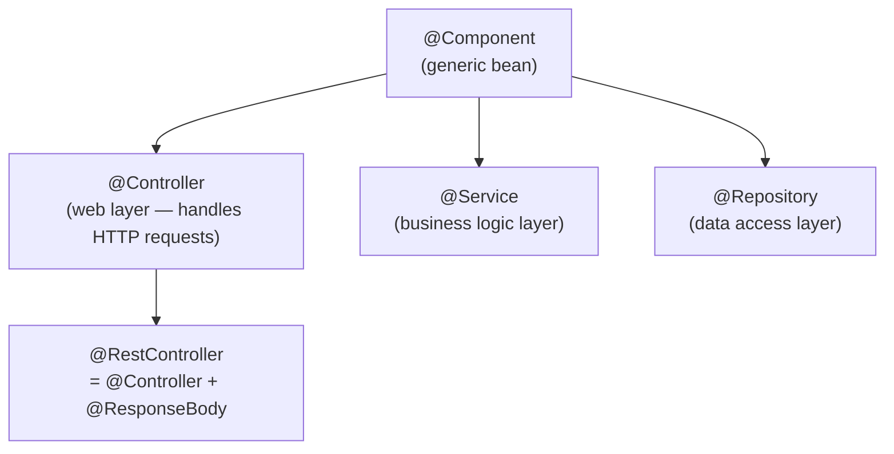
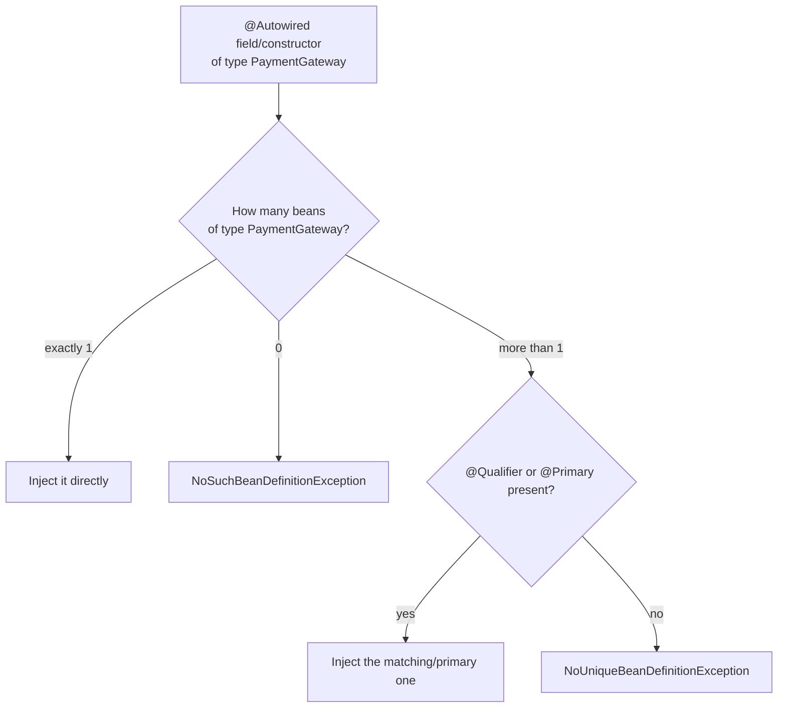
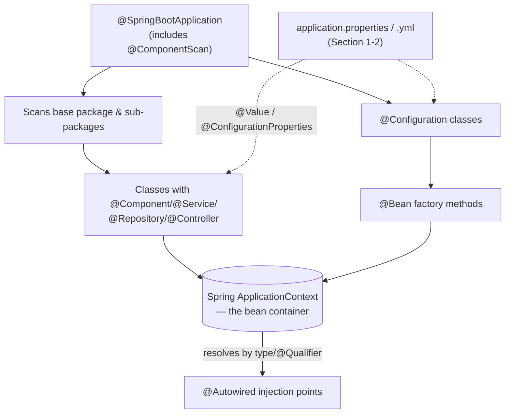

# Spring Boot Configuration & Core Annotations — Interview Notes

> Companion notes to: `application.properties`/YAML → centralized config → logging → stereotype annotations → `@ComponentScan` / `@Configuration` / `@Bean` / `@Autowired`

---

## Table of Contents

1. [application.properties / application.yml](#1-applicationproperties--applicationyml)
2. [Managing Configuration Properties](#2-managing-configuration-properties)
3. [Properties vs YAML](#3-properties-vs-yaml)
4. [Logging Configuration](#4-logging-configuration)
5. [Common Application Properties (Reference)](#5-common-application-properties-reference)
6. [Groovy Templates](#6-groovy-templates)
7. [Core Spring Annotations](#7-core-spring-annotations)
   - [7.1 @Component & Stereotype Annotations](#71-component--stereotype-annotations)
   - [7.2 @ComponentScan](#72-componentscan)
   - [7.3 @Configuration & @Bean](#73-configuration--bean)
   - [7.4 @Autowired](#74-autowired)
8. [How It All Fits Together](#8-how-it-all-fits-together)
9. [Comparison Tables](#9-comparison-tables)
10. [Interview Q&A](#10-interview-qa)

---

## 1. application.properties / application.yml

**What it is:** The default place Spring Boot looks for configuration — a flat **key-value** file, `application.properties`, that lives in `src/main/resources` (i.e., it gets bundled onto the classpath, in the **resource directory**).

```properties
server.port=8081
spring.application.name=order-service
spring.datasource.url=jdbc:mysql://localhost:3306/orders
spring.datasource.username=root
spring.datasource.password=secret
```

**Why this exists instead of hardcoding values in Java:** it separates *configuration* from *code* — the same compiled jar can behave differently in dev vs prod just by shipping a different properties file alongside it, without recompiling (this is the externalized-config idea covered in the cloud-native notes).

**How Spring Boot picks it up:** `SpringApplication` automatically loads `application.properties` (or `.yml`) from the classpath root at startup and binds the values either to `@Value("${...}")` fields or to typed `@ConfigurationProperties` classes.

```java
@Value("${server.port}")
private int port;

// or, the more scalable approach for a group of related properties:
@ConfigurationProperties(prefix = "spring.datasource")
public class DataSourceProps {
    private String url;
    private String username;
    private String password;
    // getters/setters
}
```

---

## 2. Managing Configuration Properties

**Where it lives:** the **resource directory** (`src/main/resources`) — anything here is copied onto the runtime classpath, so it's available to the app without needing an absolute file path.

**Centralized config (the bigger picture):** for a single app, one `application.properties` is fine. For a fleet of microservices, you centralize this further with a **Config Server** (Spring Cloud Config) so every service pulls its properties from one Git-backed source at startup instead of each maintaining its own copy — see the Spring Cloud notes for the full diagram.

**Profile-specific overrides** — the most commonly tested piece of this topic:
```
application.properties           # base/shared config
application-dev.properties       # overrides when profile = dev
application-prod.properties      # overrides when profile = prod
```
```properties
# application.properties
spring.profiles.active=dev
```
or via environment variable at deploy time (preferred for real deployments, since it doesn't require touching the jar):
```bash
java -jar app.jar --spring.profiles.active=prod
```

**Property source precedence (high → low) — Spring merges all of these, higher wins:**
```mermaid
flowchart TD
    A[Command-line arguments<br/>--server.port=9090] --> Z[Effective Property Value]
    B[Environment variables<br/>SERVER_PORT=9090] --> Z
    C[application-{profile}.properties/yml] --> Z
    D[application.properties/yml] --> Z
    E[@PropertySource annotated files] --> Z
    F[Default values in code] --> Z
```
(Top of the list wins when the same key is defined in multiple places.)

---

## 3. Properties vs YAML

**YAML can also be used** instead of `.properties` — same purpose, different syntax, and YAML supports **hierarchical nesting** natively instead of repeating dotted prefixes.

```yaml
# application.yml — equivalent to the .properties example above
server:
  port: 8081
spring:
  application:
    name: order-service
  datasource:
    url: jdbc:mysql://localhost:3306/orders
    username: root
    password: secret
```

```properties
# application.properties — same config, flat key-value
server.port=8081
spring.application.name=order-service
spring.datasource.url=jdbc:mysql://localhost:3306/orders
spring.datasource.username=root
spring.datasource.password=secret
```

| | `.properties` | `.yml` |
|---|---|---|
| Structure | Flat key-value pairs | Hierarchical/nested |
| Readability for deep config | Repetitive prefixes | Cleaner, less repetition |
| Multiple profiles in one file | Not supported (needs separate files) | Supported via `---` document separators |
| Comments | `#` | `#` |
| Common pitfall | — | Indentation-sensitive; tabs break it |

**"Use programming language" for config (the other note on the page):** instead of either file format, you can configure beans **in Java** itself via a `@Configuration` class with `@Bean` methods (Section 7.3) — useful when config logic needs conditionals/loops that a flat file can't express. This is the **Java-based config** style, as opposed to file-based or (older) XML-based config.

---

## 4. Logging Configuration

**Logging behaviour can also be managed** the same way — through `application.properties`/`.yml` — without touching code:

```properties
# Set root logging level
logging.level.root=INFO

# Set logging level for a specific package (more verbose for your own code)
logging.level.com.example.orderservice=DEBUG

# Send logs to a file in addition to console
logging.file.name=logs/app.log

# Customize the log pattern
logging.pattern.console=%d{yyyy-MM-dd HH:mm:ss} - %msg%n
```

Spring Boot uses **Logback** by default (via `spring-boot-starter-logging`), with SLF4J as the facade — so your code just does:
```java
private static final Logger log = LoggerFactory.getLogger(OrderService.class);
log.info("Order {} placed", orderId);
```
and the *behaviour* (level, destination, format) is entirely controlled externally via config — exactly the same externalized-config philosophy as Section 2.

---

## 5. Common Application Properties (Reference)

A grab-bag interviewers expect you to recognize on sight:

| Property | Purpose |
|---|---|
| `server.port` | Port the embedded server listens on |
| `server.servlet.context-path` | Base path prefix for all endpoints |
| `spring.application.name` | Logical service name (used in Eureka registration, logs, tracing) |
| `spring.profiles.active` | Which profile-specific properties file to layer on top |
| `spring.datasource.url/username/password` | DB connection details |
| `spring.jpa.hibernate.ddl-auto` | Schema generation strategy (`none`, `update`, `validate`, `create-drop`) |
| `spring.jpa.show-sql` | Logs generated SQL — useful in dev, off in prod |
| `management.endpoints.web.exposure.include` | Which Actuator endpoints (`health`, `metrics`, etc.) are exposed |
| `logging.level.*` | Per-package log verbosity |
| `spring.cloud.config.uri` | Where to fetch centralized config from |

---

## 6. Groovy Templates

**What it is:** Groovy Markup Templates were one of Spring Boot's supported **server-side view technologies** (alongside Thymeleaf, FreeMarker, Mustache, JSP) for rendering dynamic HTML — you'd write a `.tpl` file using Groovy's builder syntax instead of plain HTML+expressions.

```groovy
// welcome.tpl
yieldUnescaped '<!DOCTYPE html>'
html {
    head { title('Welcome') }
    body {
        p("Hello, ${name}!")
    }
}
```
```java
@GetMapping("/welcome")
public String welcome(Model model) {
    model.addAttribute("name", "Vansh");
    return "welcome";   // resolves to welcome.tpl
}
```

**Interview-relevant context:** it's a minor, rarely-used option in modern Spring Boot — **Thymeleaf is the de-facto standard** for server-rendered HTML today, and most new projects skip server-side templating entirely in favor of a separate frontend (React/Angular) talking to a REST API. Good to recognize the name; not worth deep investment.

---

## 7. Core Spring Annotations

### 7.1 @Component & Stereotype Annotations

**`@Component`** marks a class as a Spring-managed bean — "let the IoC container create and own an instance of this." It's the generic, base-level annotation.

**Stereotype annotations** are *specializations* of `@Component` — same mechanical effect (still scanned and registered as beans), but they communicate **intent** and unlock extra framework behaviour for that layer:



| Annotation | Layer | Extra behaviour beyond plain `@Component` |
|---|---|---|
| `@Controller` | Web/presentation | Methods can be mapped to HTTP requests via `@RequestMapping`; return values resolved as view names by default |
| `@RestController` | Web/REST | `@Controller` + `@ResponseBody` baked in — return values are serialized straight to the response body (JSON/XML) |
| `@Service` | Business logic | No extra container behaviour by default — purely semantic, signals "this holds business logic," helps readability and AOP pointcut targeting |
| `@Repository` | Data access | Spring translates persistence-specific exceptions (e.g., JPA's `PersistenceException`) into Spring's unchecked `DataAccessException` hierarchy automatically |

```java
@Repository
public interface OrderRepository extends JpaRepository<Order, Long> { }

@Service
public class OrderService {
    private final OrderRepository repo;
    public OrderService(OrderRepository repo) { this.repo = repo; }   // constructor injection

    public Order placeOrder(Order order) {
        return repo.save(order);
    }
}

@RestController
@RequestMapping("/orders")
public class OrderController {
    private final OrderService service;
    public OrderController(OrderService service) { this.service = service; }

    @PostMapping
    public Order create(@RequestBody Order order) {
        return service.placeOrder(order);
    }
}
```

### 7.2 @ComponentScan

**What it does:** tells Spring **which packages to scan** for classes annotated with `@Component` (and its stereotypes) so it can register them as beans automatically — without this, annotating a class with `@Service` alone does nothing; Spring has to actually *look* for it.

```java
@Configuration
@ComponentScan(basePackages = "com.example.orderservice")
public class AppConfig { }
```

In practice you almost never write `@ComponentScan` explicitly in a Spring Boot app — **`@SpringBootApplication` already includes it** (along with `@Configuration` and `@EnableAutoConfiguration`), defaulting to scan the package the main class lives in and everything below it:

```java
@SpringBootApplication   // = @Configuration + @EnableAutoConfiguration + @ComponentScan
public class OrderServiceApplication {
    public static void main(String[] args) {
        SpringApplication.run(OrderServiceApplication.class, args);
    }
}
```

**Common pitfall (interview favorite):** if a `@Component`/`@Service` class lives in a package **outside** the main application class's package tree, it won't be picked up by default scanning — you'd need to either move it or add an explicit `@ComponentScan(basePackages = {...})`.

### 7.3 @Configuration & @Bean

**The other way to register a bean** — instead of annotating your own class with `@Component`, you write a factory method inside a `@Configuration` class and annotate *that method* with `@Bean`. Essential when:
- You don't own the class's source code (e.g., a third-party library object).
- You need conditional/programmatic logic to build the object.
- You're configuring something via plain **Java Object** construction rather than scanning.

```java
@Configuration
public class AppConfig {

    @Bean
    public RestTemplate restTemplate() {
        return new RestTemplate();          // a plain Java object, not annotated with @Component
    }

    @Bean
    public ObjectMapper objectMapper() {
        ObjectMapper mapper = new ObjectMapper();
        mapper.registerModule(new JavaTimeModule());
        return mapper;
    }
}
```
Spring calls `restTemplate()` once, takes the returned object, and stores it in the ApplicationContext exactly as if it had been `@Component`-scanned — any other bean can now `@Autowired` it by type.

### 7.4 @Autowired

**What it does:** tells Spring "inject a matching bean here" — resolved primarily **by type**, and by **name/`@Qualifier`** when multiple beans of the same type exist.



**Three injection styles:**
```java
// 1. Field injection — concise, but not recommended (hard to unit test, hides required deps)
@Service
public class OrderService {
    @Autowired
    private PaymentGateway paymentGateway;
}

// 2. Setter injection — allows optional/re-configurable dependencies
@Service
public class OrderService {
    private PaymentGateway paymentGateway;
    @Autowired
    public void setPaymentGateway(PaymentGateway gateway) { this.paymentGateway = gateway; }
}

// 3. Constructor injection — RECOMMENDED: dependencies are final, required at construction,
//    and trivially mockable in unit tests. @Autowired is even optional here if there's only one constructor.
@Service
public class OrderService {
    private final PaymentGateway paymentGateway;
    public OrderService(PaymentGateway paymentGateway) {
        this.paymentGateway = paymentGateway;
    }
}
```

**Resolving ambiguity when multiple implementations exist:**
```java
public interface PaymentGateway { }

@Service
public class StripeGateway implements PaymentGateway { }

@Service
@Primary                              // tie-breaker when no @Qualifier is given
public class RazorpayGateway implements PaymentGateway { }

@Service
public class OrderService {
    public OrderService(@Qualifier("stripeGateway") PaymentGateway gateway) { ... }
}
```

---

## 8. How It All Fits Together



**Narration for an interview whiteboard:**
1. `@SpringBootApplication` kicks off `@ComponentScan`, which walks the package tree looking for `@Component` and its stereotypes.
2. In parallel, any `@Configuration` classes run their `@Bean` methods to construct beans the scanner can't create on its own (third-party objects, conditional logic).
3. Every bean found either way lands in the **ApplicationContext** — Spring's IoC container.
4. Anywhere you write `@Autowired`, Spring looks into that container and wires the matching bean in, resolving ambiguity via `@Qualifier`/`@Primary`.
5. Config values (`application.properties`/`.yml`, Sections 1–2) are injected into beans via `@Value` or `@ConfigurationProperties` at the same time — config and dependency wiring happen together at startup.

---

## 9. Comparison Tables

**`.properties` vs `.yml` vs Java-based config**
| | `.properties`/`.yml` | `@Configuration` + `@Bean` (Java) |
|---|---|---|
| Best for | Simple key-value settings (ports, URLs, flags) | Objects needing logic/conditionals to construct |
| Type safety | Strings parsed at binding time | Full compile-time type safety |
| Can express loops/conditionals | No | Yes — it's plain Java |
| Typical use | DB URL, server port, logging level | `RestTemplate`, `ObjectMapper`, third-party SDK clients |

**`@Component` vs `@Bean`**
| | `@Component` (+ stereotypes) | `@Bean` |
|---|---|---|
| Placed on | Your own class definition | A factory method inside `@Configuration` |
| Use when | You own the source and it's a straightforward singleton | You don't own the class, or need custom construction logic |
| Discovered via | `@ComponentScan` | Method invocation inside a `@Configuration` class |

**Field vs Setter vs Constructor injection**
| | Field | Setter | Constructor |
|---|---|---|---|
| Testability | Poor (needs reflection/Spring to set) | OK | Best — pass mocks directly |
| Immutability | No (`final` not possible) | No | Yes (`final` fields) |
| Required vs optional deps | Always looks required, but easy to forget | Naturally optional | Naturally required |
| Recommended by Spring team | No | Situational | **Yes** |

---

## 10. Interview Q&A

**Q1: What's the practical difference between `@Component`, `@Service`, and `@Repository` — do they behave differently at runtime?**
> Mechanically, all three get scanned and registered as beans the same way — `@Service` and `@Repository` are meta-annotated with `@Component`. The real difference is `@Repository`: Spring wraps it with exception translation, converting persistence-specific exceptions (like JPA's) into its own unchecked `DataAccessException` hierarchy. `@Service` adds no extra container behavior — it's purely semantic, signaling business-logic intent and giving AOP a stable layer to target with pointcuts (e.g., `@Transactional` aspects often target the service layer by convention).

**Q2: If `@ComponentScan` is required to find `@Component` classes, why don't I ever write it myself in a Spring Boot project?**
> Because `@SpringBootApplication` is a composed annotation that already includes `@ComponentScan` (plus `@Configuration` and `@EnableAutoConfiguration`), defaulting to scan the package of the main class and everything below it. You only need to write `@ComponentScan` explicitly if a bean class lives outside that default package tree.

**Q3: When would you use `@Bean` inside a `@Configuration` class instead of just annotating the class with `@Component`?**
> When you don't own the source code of the class (e.g., constructing a `RestTemplate` or a third-party SDK client you can't annotate), or when building the object requires conditional/programmatic logic that a plain `@Component` constructor can't express cleanly.

**Q4: Why does the Spring team recommend constructor injection over field injection?**
> Constructor injection lets dependencies be `final` and forces them to be supplied at object creation, which makes the class immutable and impossible to construct in an invalid half-wired state. It's also trivially testable — you just call `new OrderService(mockGateway)` in a unit test, with zero need for Spring or reflection, unlike field injection which requires a container (or reflection hacks) to populate `@Autowired` fields.

**Q5: What happens if `@Autowired` finds zero matching beans? What if it finds more than one?**
> Zero matches throws `NoSuchBeanDefinitionException` at startup (failing fast rather than at runtime). More than one match throws `NoUniqueBeanDefinitionException` unless you disambiguate — either by marking one implementation `@Primary` as the default tie-breaker, or by using `@Qualifier("beanName")` at the injection point to pick a specific one explicitly.

**Q6: What's the actual precedence order when the same property is defined in both `application.properties` and as a command-line argument?**
> Command-line arguments win. Spring Boot layers property sources with a defined precedence — roughly: command-line args > environment variables > profile-specific files (`application-{profile}.properties`) > the base `application.properties`/`.yml` > `@PropertySource` files > hardcoded defaults in code. Higher-precedence sources override lower ones for the same key.

**Q7: How do Spring profiles let you avoid maintaining separate environment-specific builds?**
> You keep shared config in `application.properties` and override only what differs per environment in `application-{profile}.properties` (e.g., `application-prod.properties` for a production DB URL). Which profile is active is set externally — via `spring.profiles.active` or a `--spring.profiles.active=prod` command-line flag at deploy time — so the exact same compiled jar behaves differently without being rebuilt, which is the whole point of externalized config.

**Q8: What's the difference in how `.properties` and `.yml` express nested configuration, and is there a functional difference beyond syntax?**
> `.properties` is flat — nesting is simulated via dotted prefixes (`spring.datasource.url`). YAML supports genuine hierarchical nesting via indentation, which reduces repetition for deeply nested config, and additionally lets you define multiple profile sections in a single file using `---` document separators — something `.properties` can't do without separate files. Functionally, both bind to the same underlying property keys at runtime; it's purely a authoring-format difference.

**Q9: Why does `@Repository` specifically get exception translation, and why does that matter?**
> Without it, a DAO method might throw a JPA- or JDBC-specific checked/unchecked exception, forcing every caller up the stack to know about and handle that specific persistence technology's exception types — coupling your service layer to your persistence implementation. `@Repository` triggers a post-processor that wraps thrown exceptions into Spring's generic `DataAccessException` hierarchy, so the service layer can catch one consistent exception type regardless of whether you're using JPA, JDBC, or MongoDB underneath.

**Q10: Where would you put a value that needs to be computed or validated at startup — a `.properties` key or a `@Bean` method?**
> A `.properties`/`.yml` key only stores a static value. If the value needs computation, validation, or depends on conditionally choosing between multiple implementations at startup, that logic belongs in a `@Bean` factory method inside a `@Configuration` class — you can still pull the raw input from `application.properties` via `@Value`, but the decision logic itself has to live in Java.

---

### Quick Revision Checklist
- [ ] Can explain why `@Repository`, `@Service`, `@Controller` are all technically `@Component`
- [ ] Can explain the property-source precedence order from memory
- [ ] Can justify constructor injection over field injection with a concrete reason
- [ ] Can explain what happens (and why) when `@Autowired` finds 0 or 2+ candidate beans
- [ ] Can explain when to reach for `@Bean` instead of `@Component`
- [ ] Can explain profile-specific properties and how the active profile is chosen
